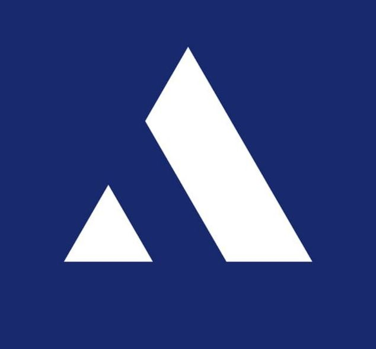

<p align="center">
  
</p>

<h1 align="center">Aegis</h1>

<p align="center">
  <strong>Autonomous Quantum Cryptographic Intelligence Platform for Banking Infrastructure</strong>
</p>

<p align="center">
  
  
  
  
  
  
  
</p>

---

> **🚀 Want to run Aegis locally?**  
> Everything is fully containerized. Please navigate to **[SETUP.md](./SETUP.md)** for the quick, 2-step installation guide. No API keys or local SDKs are required for the default local deterministic mode.

---

## 🌊 Overview

Aegis is a scan-centric platform engineered to defend internet-facing cryptographic assets against the **Harvest Now, Decrypt Later (HNDL)** threat. By merging low-level Post-Quantum Cryptography (PQC) handshake inspection with deterministic scoring and AI-grounded remediation, Aegis provides a clear bridge to a quantum-safe future.

---

## ⚙️ How It Works

Aegis continuously discovers assets, evaluates their cryptographic posture, and builds actionable technical roadmaps based on NIST FIPS standards.

1. **Asset Discovery:** Identifies domains, IPs, and open ports (TLS, VPN, API).
2. **OQS Handshake Probing:** Performs deep byte-level inspection using an Open-Quantum-Safe (OQS) patched OpenSSL engine to detect hybrid PQC key exchanges (e.g., `X25519MLKEM768`).
3. **Graph Mapping:** Stores network topologies and relationships in an **Apache AGE** graph database for real-time interactive visualization.
4. **Deterministic Scoring:** Calculates a precise quantum vulnerability risk score and compliance tier.
5. **Artifact Generation:** Produces industry-standard CycloneDX 1.6 Cryptographic Bills of Materials (CBOMs) and technical remediation patches.

---

## 🧮 Deterministic Scoring Model

Aegis relies on a strict, deterministic, and weighted formula to evaluate quantum risk, completely independent of AI hallucination. 

**Risk Formula:**
> **Risk = 100 × (0.45 × V<sub>KEX</sub> + 0.35 × V<sub>SIG</sub> + 0.10 × V<sub>SYM</sub> + 0.10 × V<sub>TLS</sub>) + P<sub>cert</sub>**

*Where:*
- **V<sub>KEX</sub>** (45%): Key Exchange Vulnerability (Highly vulnerable to Shor's Algorithm).
- **V<sub>SIG</sub>** (35%): Signature Vulnerability (Authentication risks).
- **V<sub>SYM</sub>** (10%): Symmetric Cipher Vulnerability (Grover's Algorithm impact).
- **V<sub>TLS</sub>** (10%): Protocol Version Vulnerability (Legacy TLS configurations).

**Certificate Penalty (P<sub>cert</sub>):**
- `+10` points if the certificate is expired (Days remaining ≤ 0).
- `+5` points if the certificate expires within 30 days.
*(Note: Final Risk Score is strictly capped at 100)*

**Score Semantics:**
- **Risk Score** (Backend): `0-100` scale. **Higher is more vulnerable.**
- **Q-Score** (Frontend UI): `0-100` scale. **Higher is more secure.** *(Q-Score = 100 - Risk Score)*

---

## 🏗️ Repository Structure

Aegis is built as a modular monolith. 

```text
Aegis/
├── backend/             # FastAPI engine & Core PQC Scanning Logic
│   ├── analysis/        # Risk scoring & handshake metadata resolution
│   ├── discovery/       # Multi-protocol probing (TLS, VPN, API)
│   ├── intelligence/    # RAG Orchestrator & NIST roadmap generators
│   └── pipeline/        # Deterministic scan orchestration
├── frontend/            # React + Vite UI with Tailwind CSS
│   └── src/components/  # Interactive D3/Force-Graph visualizations
├── docker/              # Infrastructure-as-Code (OQS builds, Graph DB init)
├── docs/                # Intelligence corpus (NIST Standards, FIPS PDFs)
├── documentations/      # Extended architectural & API references
├── migrations/          # Alembic relational database migrations
├── scripts/             # Data ingestion & validation utilities
├── simulation/          # Standalone terminal-based scan testing utilities
└── tests/               # Unit and Integration test suites
```

---

## 📚 Documentation Index

For detailed technical guides and references, please see the specific documentation files mapped below:

| Documentation | Purpose |
| :--- | :--- |
| 🛠️ [**SETUP.md**](./SETUP.md) | Universal installation, environment configuration, and startup guide for running Aegis. |
| 📡 [**documentations/API.md**](./documentations/API.md) | Comprehensive backend REST endpoint documentation and cURL integration examples. |
| 💾 [**documentations/DATABASE.md**](./documentations/DATABASE.md) | Detailed schema mapping for PostgreSQL, Apache AGE (Graph), and Qdrant. |
| 🧠 [**documentations/CONTEXT.md**](./documentations/CONTEXT.md) | Technical context, core principles, and developer rules for the codebase. |
| 🎯 [**documentations/SOLUTION.md**](./documentations/SOLUTION.md) | Strategic product framing, threat models, and business problem statement. |

---

<p align="center">
  Built for the future of cryptographic security.
</p>
