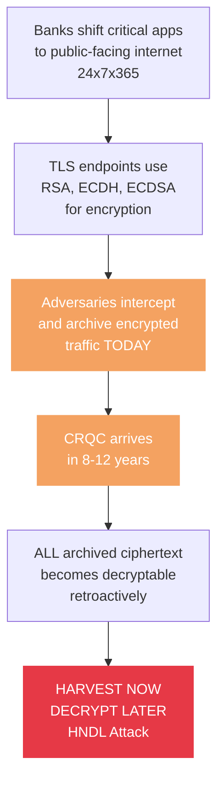
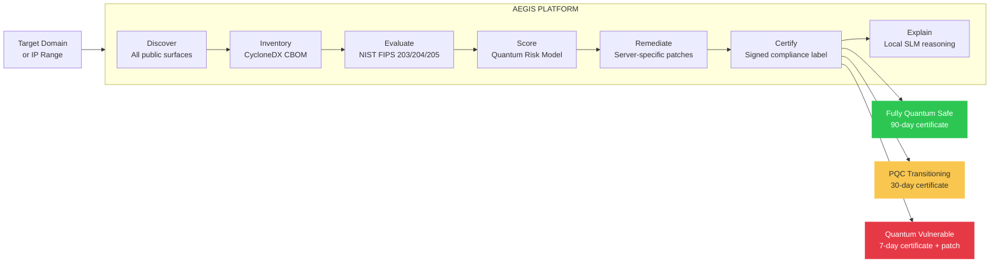
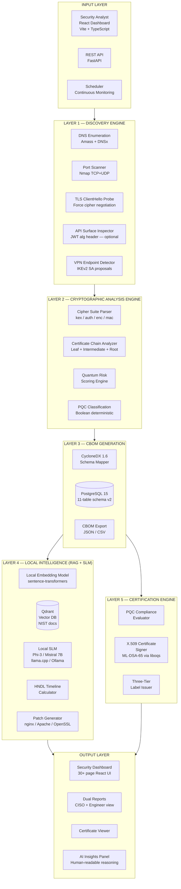
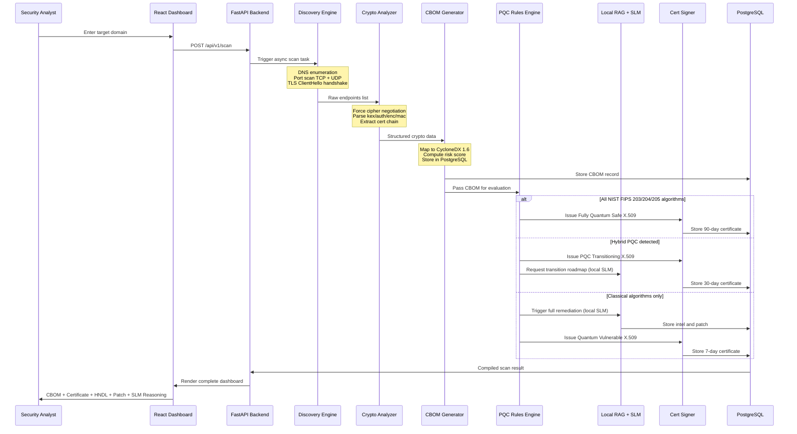
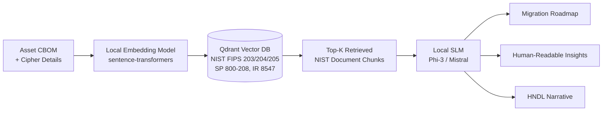
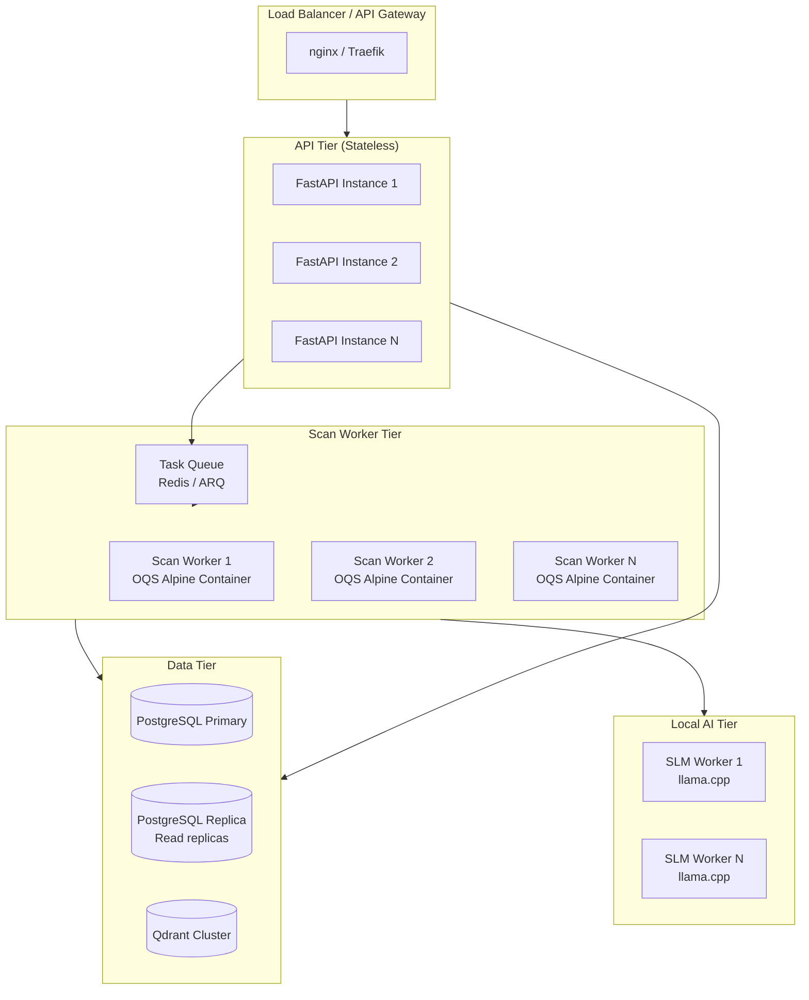
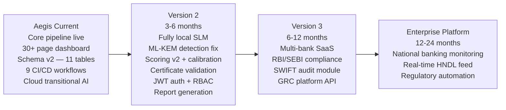

# Aegis
## Quantum Cryptographic Intelligence Platform for Banking Infrastructure

> **"Don't just scan for vulnerabilities. Prove you are safe."**

---

## Table of Contents

1. [Executive Summary](#1-executive-summary)
2. [The Problem](#2-the-problem)
3. [Cryptographic Threat Model](#3-cryptographic-threat-model)
4. [Solution Overview](#4-solution-overview)
5. [System Architecture](#5-system-architecture)
6. [Data Flow](#6-data-flow)
7. [Module Deep-Dives](#7-module-deep-dives)
8. [Risk Scoring Model](#8-risk-scoring-model)
9. [PQC Compliance Engine](#9-pqc-compliance-engine)
10. [HNDL Timeline Intelligence](#10-hndl-timeline-intelligence)
11. [Three-Tier Certification System](#11-three-tier-certification-system)
12. [CBOM Standard](#12-cbom-standard)
13. [Remediation Engine](#13-remediation-engine)
14. [Local SLM Intelligence Layer](#14-local-slm-intelligence-layer)
15. [Frontend Dashboard](#15-frontend-dashboard)
16. [Database Architecture](#16-database-architecture)
17. [Technology Stack](#17-technology-stack)
18. [CI/CD Pipeline](#18-cicd-pipeline)
19. [Security Architecture](#19-security-architecture)
20. [Scalability Design](#20-scalability-design)
21. [Key Innovations](#21-key-innovations)
22. [Future Roadmap](#22-future-roadmap)

---

## 1. Executive Summary

Banks today are accumulating **quantum debt** — every TLS handshake using RSA or ECDH generates interceptable ciphertext that adversaries are archiving right now, waiting for the day a Cryptanalytically Relevant Quantum Computer (CRQC) arrives to decrypt it retroactively. This is the **Harvest Now, Decrypt Later (HNDL)** attack vector, and it is not theoretical — it is operationally active.

**Aegis** is a continuous, autonomous Cryptographic Intelligence Platform that:

1. **Discovers** every public-facing cryptographic surface of a banking institution
2. **Inventories** the complete cryptographic posture into a machine-readable **Cryptographic Bill of Materials (CBOM)** aligned to CycloneDX 1.6
3. **Evaluates** each asset against NIST FIPS 203, FIPS 204, and FIPS 205
4. **Labels** assets with a **three-tier certification** (`Fully Quantum Safe` / `PQC Transitioning` / `Quantum Vulnerable`)
5. **Remediates** vulnerabilities with asset-type-aware, ready-to-deploy configuration patches backed by a fully local RAG pipeline grounded in authoritative NIST source documents
6. **Monitors** continuously — not a one-shot scanner, but a living cryptographic intelligence system
7. **Explains** every finding with human-readable reasoning generated by a locally-hosted Small Language Model (SLM)

**Core design principles for the complete platform:**
- **Designed for fully local operation** — all AI, embeddings, and LLM inference are architected to run on-premise with zero cloud dependencies; the current prototype uses cloud embedding providers (Jina AI, Cohere, OpenRouter) as a transitional configuration — local SLM replacement is Version 2 Priority 1
- **Fully deterministic security** — compliance tiers and risk scores are never influenced by AI; all classification and scoring is hermetically isolated from the intelligence layer
- **Fully scalable** — horizontal scaling for multi-bank, multi-tenant deployment via stateless API tier + Redis task queue + isolated scan workers
- **Zero external secrets in production target** — no Groq, Jina, or OpenRouter keys required once the local SLM migration is complete

---

## 2. The Problem



**What banks currently lack:**
- No automated discovery of which assets use quantum-vulnerable cryptography
- No structured Cryptographic Bill of Materials (CBOM)
- No evidence-based timeline for when each asset becomes decryptable
- No deployment-ready PQC configuration patches
- No human-readable reasoning to understand what their risk actually means

---

## 3. Cryptographic Threat Model

### Algorithm Threat Classification

| Algorithm | Quantum Threat | Quantum Algorithm | Status |
|---|---|---|---|
| RSA-2048 | **BROKEN** — Shor solves factoring | Shor's | 🔴 Migrate now |
| ECDH (all curves) | **BROKEN** — Shor solves discrete log | Shor's | 🔴 Migrate now |
| ECDSA | **BROKEN** — certificate forgery possible | Shor's | 🔴 Migrate now |
| AES-128 | **Weakened** — Grover halves to 64-bit effective | Grover's | 🟠 Upgrade |
| AES-256 | **Acceptable** — Grover → 128-bit effective, still secure | Grover's | 🟢 Not a priority |
| SHA-384/512 | **Acceptable** post-Grover | Grover's | 🟢 Not a priority |
| ML-KEM-768 | **Resistant** — NIST FIPS 203 | N/A | 🟢 PQC Safe |
| ML-DSA-65 | **Resistant** — NIST FIPS 204 | N/A | 🟢 PQC Safe |

> **Critical distinction:** AES-256 is NOT quantum-broken. Grover's algorithm reduces it from 256-bit to 128-bit effective security — still entirely acceptable. Every competing solution that flags AES-256 as a quantum emergency fails the most basic expert test.

---

## 4. Solution Overview



---

## 5. System Architecture



---

## 6. Data Flow



---

## 7. Module Deep-Dives

### 7.1 Discovery Engine

The discovery engine takes a domain, IP, or CIDR as input and produces a deduplicated list of live cryptographic surfaces. DNS resolution results are persisted in the `dns_records` table. Pipeline events are written to `scan_events` for immutable audit trails.

**Scope:**
- TLS endpoints on ports 443/8443 — fully implemented
- VPN scanning — endpoint detection implemented (IKEv2/OpenVPN port identification); protocol-level analysis is partial since many VPN servers block unauthenticated probes; detected metadata stored in `discovered_assets.asset_metadata`
- JWT inspection — optional module, activated only when accessible endpoints return Authorization headers

**Asset fingerprinting:** A new `asset_fingerprints` table tracks stable logical asset identity across scans using `hostname:port/protocol` as a canonical key, enabling cross-scan delta computation and score trend history.

### 7.2 Cipher Suite Parser

Decomposes every TLS cipher string into four independent components:

- `TLS_ECDHE_RSA_WITH_AES_256_GCM_SHA384` → kex=ECDHE, auth=RSA, enc=AES_256_GCM, mac=SHA384
- TLS 1.3 ciphers (e.g. `TLS_AES_256_GCM_SHA384`) are handled separately — key exchange and authentication are negotiated in the TLS 1.3 handshake, not the cipher string

Each component maps to a vulnerability value (0.00–1.00) via a deterministic lookup table with algorithm aliases for all known variants including hybrid PQC (`X25519MLKEM768`, hex code `0x11EC`, etc.).

### 7.3 Cryptographic Analysis Engine

**Modules:**
- `cipher_parser.py` — regex + delimiter-based cipher decomposition
- `cert_analyzer.py` — leaf/intermediate/root certificate chain extraction
- `risk_scorer.py` — weighted formula producing 0–100 score
- `handshake_metadata_resolver.py` — TLS handshake metadata normalization
- `constants.py` — deterministic vulnerability lookup tables

---

## 8. Risk Scoring Model

### Formula

```
QuantumRiskScore = (0.45 × V_kex) + (0.35 × V_sig) + (0.10 × V_sym) + (0.10 × V_tls)
```

| Component | Weight | Rationale |
|---|---|---|
| Key Exchange (`V_kex`) | **0.45** | Shor's completely breaks all classical KEX |
| Signature (`V_sig`) | **0.35** | Shor's breaks RSA/ECDSA — enables certificate forgery |
| Symmetric (`V_sym`) | **0.10** | Grover weakens but does NOT break AES-256 |
| TLS Version (`V_tls`) | **0.10** | TLS 1.0/1.1 have structural weaknesses beyond quantum |

### Vulnerability Values

| Algorithm | V_kex | V_sig | V_sym |
|---|---|---|---|
| ECDH / ECDHE (all curves) | 1.00 | — | — |
| RSA key transport | 1.00 | — | — |
| DHE (all groups) | 1.00 | — | — |
| X25519 + ML-KEM (hybrid) | 0.30 | — | — |
| ML-KEM-512/768/1024 | 0.00 | — | — |
| RSA signature | — | 1.00 | — |
| ECDSA (all curves) | — | 1.00 | — |
| ML-DSA-44/65/87 | — | 0.00 | — |
| SLH-DSA | — | 0.00 | — |
| AES-128 | — | — | 0.50 |
| AES-256 / AES-256-GCM | — | — | 0.05 |
| ChaCha20-Poly1305 | — | — | 0.05 |
| 3DES / DES / RC4 | — | — | 1.00 |

### TLS Version Vulnerability

| Version | V_tls |
|---|---|
| TLS 1.0 / 1.1 | 0.80 |
| TLS 1.2 | 0.40 |
| TLS 1.3 | 0.10 |

### Planned Scoring Improvements

The current scoring model will be enhanced with:
- **Certificate-level scoring:** factor in key size, signature algorithm, and days to expiry
- **Forward secrecy bonus:** reward ephemeral key exchange explicitly
- **Multi-cipher penalty:** when a server supports both PQC and classical in its cipher list, apply a weighted average rather than best-case scoring
- **Cross-scan delta scoring:** compare score change across scans of the same logical asset using `asset_fingerprints.q_score_history` for trend-aware risk assessment

---

## 9. PQC Compliance Engine

The compliance engine is **fully deterministic** — no LLM or probabilistic output ever influences risk scores, compliance tiers, or certificate issuance. Security cannot hallucinate.

**Three-axis evaluation:**

1. **Key Exchange:** RSA/ECDH/DHE → FAIL | X25519+ML-KEM hybrid → HYBRID | ML-KEM-512/768/1024 → PASS
2. **Signature:** RSA/ECDSA/DSA → FAIL | Ed25519+ML-DSA hybrid → HYBRID | ML-DSA-44/65/87, SLH-DSA → PASS
3. **Symmetric:** 3DES/RC4/DES → FAIL | AES-128 → WARN | AES-256/ChaCha20 → OK

**Tier assignment:**
- All PASS → `FULLY_QUANTUM_SAFE`
- No FAIL, at least one HYBRID → `PQC_TRANSITIONING`
- Any FAIL in KEX or SIG → `QUANTUM_VULNERABLE`

This logic lives exclusively in `backend/compliance/rules_engine.py` and is architecturally isolated from the RAG and SLM layers.

---

## 10. HNDL Timeline Intelligence

### Formula

```
BreakYear = CurrentYear + (RequiredLogicalQubits_algorithm / ProjectedQubitGrowthRate_roadmap)
```

### Algorithm-Specific Data

| Algorithm | Required Logical Qubits | Estimated Break Year |
|---|---|---|
| ECDH P-256 | ~2,330 | ~2032 |
| RSA-2048 | ~4,000 | ~2036 |
| RSA-4096 | ~8,000 | ~2046 |
| ML-KEM-768 | No known quantum break | PQC Safe |

All qubit growth rates are sourced from IBM Quantum Roadmap and Google Qubit Projections, stored as documents in Qdrant and cited in every HNDL report.

---

## 11. Three-Tier Certification System

Every scanned asset receives a cryptographically signed X.509 compliance certificate. The tier, validity window, and embedded metadata are determined entirely by the deterministic compliance engine.

| Tier | Condition | Validity | Key Extensions |
|---|---|---|---|
| **FULLY_QUANTUM_SAFE** | All KEX + SIG pass NIST FIPS 203/204 | 90 days | `PQC-READY=TRUE`, `FIPS-COMPLIANT=203+204` |
| **PQC_TRANSITIONING** | Hybrid only, no classical FAIL | 30 days | `PQC-STATUS=HYBRID`, `CLASSICAL-RISK=PARTIAL` |
| **QUANTUM_VULNERABLE** | Any classical KEX or SIG | 7 days | `PQC-STATUS=VULNERABLE`, `Remediation-Bundle-ID` |

**Certificate signing:** Primary method uses ML-DSA-65 via OQS OpenSSL subprocess (liboqs). Fallback uses ECDSA-signed X.509 with custom `PQC-STATUS` OID extensions — compliance evidence is preserved regardless of the signing algorithm.

**Why short expiry windows matter:** A 7-day certificate for a vulnerable asset enforces operational urgency. Banks must continuously re-prove their compliance posture, not just pass once.

---

## 12. CBOM Standard

Aegis generates a **CycloneDX 1.6-compliant CBOM** — a machine-readable, enterprise-importable artifact that feeds directly into GRC systems.

```json
{
  "bomFormat": "CycloneDX",
  "specVersion": "1.6",
  "serialNumber": "urn:uuid:aegis-scan-20260312-api-pnb-com",
  "metadata": {
    "timestamp": "2026-03-12T10:30:00Z",
    "tools": [{ "name": "Aegis", "version": "1.0.0" }],
    "component": { "type": "service", "name": "api.pnb.com" }
  },
  "components": [{
    "type": "cryptographic-asset",
    "bom-ref": "tls-api-pnb-com-443",
    "cryptoProperties": {
      "assetType": "protocol",
      "tlsProperties": {
        "version": "1.2",
        "cipherSuites": ["TLS_ECDHE_RSA_WITH_AES_256_GCM_SHA384"],
        "keyExchange": "ECDHE",
        "authentication": "RSA-2048",
        "encryption": "AES-256-GCM",
        "integrity": "SHA-384"
      }
    }
  }],
  "quantumRiskSummary": {
    "overallScore": 84.5,
    "tier": "QUANTUM_VULNERABLE",
    "hndlUrgency": "HIGH",
    "estimatedBreakYear": 2036,
    "priorityActions": ["migrate-key-exchange", "migrate-signature-algorithm"]
  }
}
```

The CBOM `serialNumber` uses a deterministic URN scheme enabling deduplication and diff tracking across repeated scans.

---

## 13. Remediation Engine

Every remediation patch is **asset-type-aware** and contains **actual PQC directives** — not generic TLS 1.3 advice.

### Correct nginx PQC Configuration (Generated by Aegis)

```nginx
# Aegis Generated — PQC Hybrid Configuration
# Requires: OpenSSL 3.x with OQS provider compiled from source

server {
    listen 443 ssl;
    ssl_protocols TLSv1.3;

    # Hybrid PQC key exchange: X25519 (classical) + ML-KEM-768 (NIST FIPS 203)
    ssl_ecdh_curve X25519MLKEM768:X25519;

    # Replace RSA cert with ML-DSA-65 (NIST FIPS 204)
    ssl_certificate     /etc/ssl/pqc/api.pnb.com.mldsa65.crt;
    ssl_certificate_key /etc/ssl/pqc/api.pnb.com.mldsa65.key;

    # AES-256-GCM is quantum-acceptable — no change needed
    ssl_ciphers TLS_AES_256_GCM_SHA384:TLS_CHACHA20_POLY1305_SHA256;
}
```

> `ssl_ecdh_curve X25519MLKEM768` requires an OQS-provider-patched OpenSSL build. This is the actual hybrid PQC directive, not a generic config.

**Structured remediation actions** are stored in the `remediation_actions` table (schema v2), with fields for `priority` (P1–P4), `finding`, `action`, `effort`, `status`, `category`, and `nist_reference`. This enables the frontend Action Plan page to show queryable, filterable, trackable remediation items rather than a free-text blob.

---

## 14. Local SLM Intelligence Layer

> **Design goal:** The complete platform must operate with zero external API dependencies. All AI inference runs on-premise inside the Docker stack.

### Current State (Cloud Transitional)

The current codebase uses cloud embedding providers (Jina AI, Cohere, OpenRouter) and cloud LLM providers (Groq Llama 3.3 70B, OpenRouter Gemma 3) via a subprocess isolation pattern (`cloud_utils.py`) that bypasses the OQS-patched OpenSSL environment. A deterministic fallback roadmap generator operates when no cloud providers are configured. The Qdrant collection is populated at setup time using whichever embedding provider is configured — the vector dimension auto-detects from the provider's output (currently 1024 dimensions with Jina). **This cloud dependency is a prototype transitional state, not an architectural requirement.**

### Target State (Fully Local)

The fully local intelligence layer replaces all cloud providers with:

#### Local Embedding Engine
- **Model:** `sentence-transformers/all-MiniLM-L6-v2` or `nomic-embed-text` via `llama.cpp`
- **Runtime:** Loaded at startup, served in-process — no subprocess isolation required
- **Fallback:** TF-IDF BM25 keyword retrieval for environments with constrained GPU/CPU resources
- **Configuration:** `EMBEDDING_PROVIDER_MODE=local` in `.env`

#### Local SLM (Small Language Model)
- **Model:** Phi-3-mini (3.8B) or Mistral 7B quantized (Q4_K_M GGUF format)
- **Runtime:** `llama.cpp` Python bindings (`llama-cpp-python`) or Ollama HTTP sidecar
- **Tasks performed by the SLM:**
  1. **Remediation roadmap generation** — structured 3-phase migration plan grounded in retrieved NIST chunks
  2. **Human-readable insight bullets** — plain-English explanations of each risk finding for non-technical users
  3. **HNDL narrative** — converts the deterministic break-year formula into an understandable timeline explanation
  4. **Executive summary generation** — per-scan CISO-level summary paragraph
- **Strict constraints:** The SLM has **read-only** access to CBOM data. It cannot modify risk scores, compliance tiers, or certificate decisions. Every SLM output is clearly labeled as AI-generated reasoning, never as a deterministic security fact.
- **Configuration:** `LLM_PROVIDER_MODE=local` in `.env`; model file path configurable via `LOCAL_LLM_MODEL_PATH`

#### Local RAG Pipeline Architecture



#### Design Constraints
- The local SLM is a **reasoning layer only** — never a security decision layer
- Every insight generated by the SLM is prefixed with its retrieval source citations
- If the local SLM produces empty or incoherent output, the system falls back to the deterministic stub generator

---

## 15. Frontend Dashboard

**Stack:** React 18 + TypeScript + Vite + Tailwind CSS + shadcn/ui + Recharts + Framer Motion

The frontend is a single-page application served on port 3000, connecting to the FastAPI backend at port 8000 via `src/lib/api.ts`. All data flows through `SelectedScanContext`, which loads live scan results for any scan UUID.

### Page Inventory

| Route | Page | Data Source |
|---|---|---|
| `/` | Landing Page | Static marketing content |
| `/login` | Login | Local auth (`aegis-auth` in localStorage) |
| `/dashboard` | Mission Control | Live selected scan + scan history |
| `/dashboard/discovery` | Asset Discovery | SSL/TLS assets from selected scan (live); domain enumeration, IP, software, and shadow IT tabs populated from `dns_records` and `discovered_assets` — full tab wiring in development |
| `/dashboard/inventory` | Asset Inventory | Selected scan assets |
| `/dashboard/assets/:id` | Asset Detail | Full per-asset crypto detail |
| `/dashboard/cbom` | CBOM Overview | Selected scan + persisted CBOMs |
| `/dashboard/cbom/per-asset` | CBOM Per-Asset | Real CBOM JSON from backend |
| `/dashboard/cbom/export` | CBOM Export | JSON + CSV (PDF/XML planned) |
| `/dashboard/pqc/compliance` | PQC Compliance | Live compliance tier distribution |
| `/dashboard/pqc/hndl` | HNDL Timeline | HNDL heatmap from asset data |
| `/dashboard/pqc/quantum-debt` | Quantum Debt | Migration progress modelling |
| `/dashboard/rating/enterprise` | Enterprise Q-Score | Aggregated across scans |
| `/dashboard/rating/per-asset` | Per-Asset Rating | Score trends from `asset_fingerprints.q_score_history` |
| `/dashboard/remediation/action-plan` | Action Plan | Structured remediation actions from `remediation_actions` table |
| `/dashboard/remediation/ai-patch` | AI Patch Generator | Persisted patch_config + actions |
| `/dashboard/remediation/roadmap` | Migration Roadmap | Derived from remediation artifacts |
| `/dashboard/reporting/executive` | Executive Reports | Scan context + history |
| `/dashboard/reporting/scheduled` | Scheduled Reports | Config UI (backend pending) |
| `/dashboard/reporting/on-demand` | On-Demand Builder | Config UI (backend pending) |
| `/dashboard/scan-console` | Scan Console | Simulated terminal for scan progress display; live `scan_events` integration planned |
| `/dashboard/history` | Scan History | Real scan history API |
| `/dashboard/scans/:scanId` | Scan Report | Per-scan detail + delta |
| `/dashboard/settings/scan-config` | Scan Config | Local form state |
| `/dashboard/settings/notifications` | Notifications | Notification prefs |
| `/dashboard/settings/integrations` | Integrations | Integration cards |

### Key Data Interfaces

```typescript
Asset {
  id, domain, url, port, type, tls, cipher, keyExchange,
  certInfo: CertificateInfo, qScore (0–100, higher = more secure;
    inverted from backend risk_score via: qScore = 100 - risk_score),
  status, tier, ip, hndlYears, hndlBreakYear, hndlRiskLevel,
  dimensionScores: DimensionScores, forwardSecrecy, hstsEnabled,
  ownerTeam, businessCriticality, lastScanned,
  software: SoftwareInfo | null, remediation: RemediationAction[]
}

DimensionScores {
  tls_version, key_exchange, cipher_strength,
  certificate_algo, forward_secrecy, pqc_readiness  // each 0-100
}
```

### Dashboard Views

The Mission Control page supports three role-based views switchable via `ViewRoleToggle`:
- **Analyst view:** NetworkGraph, AssetTable, QScoreOverview, IntelligencePanel, CertExpiryTimeline, CryptoSecurityOverview, RecentActivityFeed
- **Executive view:** Pie charts (status distribution, key length, cipher usage), top findings, compliance package
- **Compliance view:** NIST compliance matrix, audit trail

---

## 16. Database Architecture

**PostgreSQL 15** with a fully-migrated schema v2 (`migrations/versions/`). All models live in `backend/models/`.

### Table Inventory

| Table | Purpose |
|---|---|
| `scan_jobs` | One row per scan; tracks status, target, profile, initiated_by |
| `discovered_assets` | One row per discovered cryptographic surface per scan |
| `dns_records` | DNS resolution results per hostname per scan (Domains tab) |
| `scan_events` | Immutable audit log of pipeline events (replaces in-memory ScanRuntimeStore) |
| `crypto_assessments` | Risk score, compliance tier, all 4 vulnerability components |
| `certificate_chains` | Leaf/intermediate/root cert data with quantum_safe flag |
| `cbom_documents` | Full CycloneDX 1.6 JSON per asset |
| `remediation_bundles` | Raw generated patch_config, migration_roadmap, HNDL timeline |
| `remediation_actions` | Structured P1–P4 action items derived from bundles |
| `compliance_certificates` | Issued X.509 compliance certs with tier, validity, PEM |
| `asset_fingerprints` | Cross-scan identity tracking; q_score_history JSONB array |

### Asset Fingerprinting

The `asset_fingerprints` table is the backbone of cross-scan intelligence. It uses `hostname:port/protocol` as a stable canonical key and maintains:
- `first_seen_scan_id` / `last_seen_scan_id` — scan provenance
- `q_score_history` — ordered JSONB array of `{scan_id, q_score, scanned_at}` snapshots
- `latest_compliance_tier` — denormalized for fast queries

This enables the per-asset rating trend view and delta computation in `ScanHistory` without expensive cross-scan joins.

### Repository Layer

All database access goes through typed async repository classes in `backend/repositories/`:
- `ScanJobRepository`, `AssetRepository`, `CryptoAssessmentRepository`
- `CBOMRepository`, `RemediationBundleRepository`, `ComplianceCertificateRepository`
- `DNSRecordRepository`, `ScanEventRepository`, `AssetFingerprintRepository`
- `CertificateChainRepository`

---

## 17. Technology Stack

### Backend
- **FastAPI** (Python 3.11) — async REST API, scan orchestration
- **SQLAlchemy** (async) + **Alembic** — ORM and migrations
- **asyncio + httpx** — concurrent TLS probing (no Celery/Redis needed at current scale)
- **sslyze + pyOpenSSL** — TLS handshake engine (inside OQS container)
- **python-nmap** — port scanning
- **liboqs via oqs-python** — real ML-KEM, ML-DSA, SLH-DSA operations
- **LangChain** — RAG workflow orchestration
- **Qdrant** — vector database for NIST document embeddings
- **Amass** — subdomain enumeration
- **Ruff** — Python linter and formatter

### Frontend
- **React 18** + **TypeScript** — component framework
- **Vite** — build tool (served on port 3000)
- **Tailwind CSS** + **shadcn/ui** (Radix UI) — design system
- **Recharts** — risk heatmap and score visualizations
- **Framer Motion** — animations
- **TanStack Query** — async state management
- **React Router v6** — client-side routing

### Infrastructure
- **Docker + Compose** — one-command deployment
- **Alpine Linux** — backend container base (PQC-native)
- **OQS-patched OpenSSL 3.x** — compiled from source in Dockerfile
- **liboqs** — compiled from source in same image
- **PostgreSQL 15** — primary data store
- **Qdrant** — vector store
- **pgAdmin 4** — database management UI (port 5050)

### Planned: Local AI Stack
- **llama-cpp-python** or **Ollama** — local SLM inference
- **sentence-transformers** — local text embeddings
- **GGUF model files** — Phi-3-mini or Mistral 7B Q4_K_M

---

## 18. CI/CD Pipeline

Aegis implements a GitHub Actions-based CI/CD pipeline with nine workflows covering code quality, security, and deployment.

### Workflow Inventory

| Workflow | File | Trigger | Purpose |
|---|---|---|---|
| **Backend CI** | `backend-ci.yml` | Push/PR to `main` (backend/tests paths) | Runs full pytest suite with Docker-backed Postgres + Qdrant |
| **Frontend CI** | `frontend-ci.yml` | Push/PR to `main` (frontend paths) | ESLint + Vite production build |
| **Python Lint** | `python-lint.yml` | Push/PR to `main` (backend/tests/scripts) | Ruff lint + format check |
| **Docker CI** | `docker-ci.yml` | Push/PR to `main` (docker/compose/requirements) | OQS Dockerfile build validation with GHA cache |
| **Docker Publish** | `docker-publish.yml` | Push to `main` + semver tags | Builds + pushes to GHCR, signs image with Cosign/Sigstore |
| **CodeQL** | `codeql.yml` | Push/PR/weekly cron | Static security analysis for Python + JavaScript/TypeScript |
| **Dependency Review** | `dependency-review.yml` | PR (requirements/package changes) | Blocks known-vulnerable dependency introductions |
| **Release** | `release.yml` | Semver tag push | Auto-generates changelog + GitHub Release |
| **Stale** | `stale.yml` | Daily cron | Marks stale issues (30d) and PRs (45d) |

### Planned CI/CD Additions

- **PQC Linting Check** — custom GitHub Action that scans Python imports for deprecated cryptography library calls (e.g. `Crypto.PublicKey.RSA`, `ecdsa` package usage) and fails the build
- **Schema Migration Validator** — checks that every Alembic migration has a valid `downgrade()` function and runs `alembic check` against a test database
- **Integration Test Matrix** — expand backend CI to include multi-target scan integration tests using a test TLS server
- **Coverage Gate** — enforce minimum pytest coverage threshold (target: 80%) using `pytest-cov`; fail PR if coverage drops

---

## 19. Security Architecture

### Defense-in-Depth Principles

Aegis is designed to banking-grade security standards:

#### No Secrets at Runtime
- No hardcoded API keys or credentials in any source file
- All secrets loaded from environment variables or Docker secrets mounts
- `.env` is gitignored; `.env.example` ships with placeholder values only
- `SECRET_KEY` must be rotated before any production deployment

#### Network Isolation
- Backend container communicates with PostgreSQL and Qdrant only on the internal Docker network
- No backend port is exposed to external hosts except port 8000 (API)
- The OQS-patched OpenSSL library runs in an isolated Alpine container — the PQC cryptographic surface never touches the host OS

#### PQC Subprocess Isolation
- Cloud API calls (current transitional state) use `cloud_utils.py` subprocess isolation: a clean Python subprocess strips `OPENSSL_CONF` and `LD_LIBRARY_PATH` before making HTTPS calls, preventing the OQS OpenSSL from interfering with standard TLS to cloud endpoints
- In the fully local target state, this isolation layer disappears entirely since no outbound API calls are made

#### Deterministic Security Core
- The `compliance/rules_engine.py` and `analysis/` modules are hermetically sealed from the intelligence layer
- No AI, LLM, or probabilistic output can modify a risk score, change a compliance tier, or influence certificate issuance
- CBOM documents are stored as immutable JSONB — no post-generation mutation

#### Authentication (Prototype → Production Path)
- Current prototype uses localStorage-based auth (`aegis-auth`) for UI access control only — adequate for hackathon demonstration, not for production deployment
- Production target: JWT-based auth with `python-jose`, bcrypt password hashing, role-based access (Analyst / CISO / Auditor / Admin) via `POST /api/v1/auth/login` endpoint
- Multi-tenant isolation via scan-level ownership and PostgreSQL row-level security with `bank_id` column

#### Input Validation
- All API inputs validated via Pydantic schemas in `backend/api/v1/schemas.py`
- Domain/IP/CIDR targets sanitized before being passed to discovery tools
- SQL injection impossible via SQLAlchemy parameterized queries

#### CodeQL + Dependency Review
- GitHub CodeQL scans Python and TypeScript on every push for OWASP Top 10 class vulnerabilities
- Dependency Review blocks PRs that introduce dependencies with known CVEs

---

## 20. Scalability Design

### Current Scale
- Single FastAPI process with asyncio concurrency (~50 concurrent TLS handshakes)
- Single PostgreSQL instance with indexed queries
- Single Qdrant instance
- Single-tenant (one bank, one operator)

### Horizontal Scaling Architecture (Target)



**Key scalability decisions:**
- API tier is **stateless** — any instance can serve any request
- Scan workers are isolated OQS Alpine containers scheduled via a task queue (ARQ + Redis)
- The local SLM tier runs on dedicated GPU/CPU workers, decoupled from scan workers
- PostgreSQL read replicas serve the dashboard's read-heavy workload
- Multi-tenancy: per-bank schema isolation or row-level security on all tables with `bank_id` column
- `asset_fingerprints` enables efficient cross-scan analytics without full table scans

---

## 21. Key Innovations

### Innovation 1 — Mathematically Correct Quantum Risk Model
AES-256 receives a weight of 0.05 — not 1.00. This reflects the actual physics: Grover's algorithm only halves effective security. Every competing solution that scores AES-256 as a critical quantum vulnerability fails the most basic expert test.

### Innovation 2 — Four-Surface Asset Discovery
TLS endpoints + API gateways (JWT alg inspection) + VPN endpoints (IKEv2/OpenVPN detection) + Certificate chain analysis (leaf + intermediate + root). Most tools cover only TLS endpoints.

### Innovation 3 — Evidence-Backed per-Asset HNDL Timeline
Break year computed from `RequiredLogicalQubits / ProjectedQubitGrowthRate`, with qubit data from IBM and Google roadmaps stored in Qdrant. Per-asset, per-algorithm — not a generic "8–12 years" estimate.

### Innovation 4 — Three-Tier Certification
The `PQC_TRANSITIONING` tier correctly validates hybrid implementations (X25519+ML-KEM768) as a legitimate migration step. Binary safe/unsafe misses the migration reality.

### Innovation 5 — Asset-Type-Aware Patch Generation
nginx gets `ssl_ecdh_curve X25519MLKEM768`. Apache gets `SSLOpenSSLConfCmd Curves X25519MLKEM768`. Every patch targets OQS-provider-enabled OpenSSL with ML-DSA-65 certificate deployment directives.

### Innovation 6 — Fully Local AI Stack
Zero external API dependencies in production. The local SLM provides human-readable reasoning for non-technical stakeholders without leaking cryptographic asset data to third-party cloud providers.

### Innovation 7 — Immutable Audit Trail with Asset Memory
`scan_events` provides a persistent, queryable audit log of every pipeline event — written to PostgreSQL at scan completion, surviving backend restarts, and available for regulatory audit. `asset_fingerprints` tracks the same logical asset across scans using `hostname:port/protocol` as a stable canonical key, maintaining a `q_score_history` JSONB array that powers the per-asset trend view in the dashboard without expensive cross-scan joins.

### Innovation 8 — Risk Score Direction Inversion at the Adapter Layer
The backend computes a `risk_score` where 0 = safe and 100 = vulnerable (mathematically correct for a weighted vulnerability formula). The frontend displays a `qScore` where 0 = vulnerable and 100 = safe (intuitive for a security rating gauge). Rather than changing either model, a typed adapter layer (`src/lib/adapters.ts`) applies `qScore = 100 - risk_score` as a deterministic transformation, keeping both models internally consistent and the conversion auditable in a single location.

---

## 22. Future Roadmap



### Version 2 Priorities (3–6 months)
1. **Fully local SLM** — replace Groq/Jina with llama.cpp + sentence-transformers; `LLM_PROVIDER_MODE=local` in `.env`
2. **Scoring v2** — certificate-level scoring (key size, signature algo, days to expiry), forward secrecy bonus, multi-cipher penalty, cross-scan delta scoring via `asset_fingerprints.q_score_history`
3. **ML-KEM hex detection fix** — improve `tls_probe.py` to reliably distinguish pure ML-KEM-768 (IANA group 0x0200, V_kex=0.00) from hybrid X25519+ML-KEM-768 (IANA 0x11EC, V_kex=0.30) across all OQS-OpenSSL server configurations
4. **Risk formula calibration suite** — `tests/unit/test_risk_scorer_calibration.py` with assertions for known asset profiles (pure ML-KEM-768 → score~0, RSA-2048+TLS1.2 → score~85, hybrid → score~30)
5. **Certificate validation** — OCSP stapling check, chain of trust validation, CRL distribution points, SHA-256 fingerprint extraction in `cert_analyzer.py`
6. **Risk reasoning fields** — `risk_explanation` object on `AssessmentResponse` with per-component human-readable reasoning strings (e.g. "RSA key exchange is fully broken by Shor's algorithm") and NIST reference citations
7. **JWT authentication** — role-based access (Analyst / CISO / Auditor); `POST /api/v1/auth/login` with `python-jose` + bcrypt
8. **Report generation** — PDF executive reports, CycloneDX XML export
9. **PQC linting CI check** — GitHub Action that blocks deprecated crypto imports
10. **Coverage gate** — 80% pytest coverage enforcement in CI
11. **CommandPalette wiring** — live asset + scan history search

### Version 3 Priorities (6–12 months)
- Multi-bank SaaS with per-tenant data isolation
- RBI and SEBI compliance reporting integration
- SWIFT network PQC readiness audit module
- GRC platform API (Archer, ServiceNow)

### Enterprise Platform (12–24 months)
- National banking cryptographic monitoring backbone
- Real-time HNDL threat intelligence feed (qubit development news)
- Regulatory submission artifact automation
- Horizontal scaling to hundreds of concurrent scans

---

## Appendix — NIST PQC Algorithm Reference

| Standard | Algorithm | Security Level | Replaces | Quantum Safe |
|---|---|---|---|---|
| FIPS 203 | ML-KEM-512 | Level 1 | ECDH P-256 | ✅ |
| FIPS 203 | ML-KEM-768 | Level 3 | ECDH P-384 | ✅ |
| FIPS 203 | ML-KEM-1024 | Level 5 | ECDH P-521 | ✅ |
| FIPS 204 | ML-DSA-44 | Level 2 | ECDSA P-256 | ✅ |
| FIPS 204 | ML-DSA-65 | Level 3 | ECDSA P-384 | ✅ |
| FIPS 204 | ML-DSA-87 | Level 5 | ECDSA P-521 | ✅ |
| FIPS 205 | SLH-DSA-128s | Level 1 | RSA-2048 (backup) | ✅ |
| FIPS 205 | SLH-DSA-256f | Level 5 | RSA-4096 (backup) | ✅ |

**Recommended migration path for banking:** ML-KEM-768 (key exchange) + ML-DSA-65 (signatures) — Level 3 security matches existing banking cryptographic standards and is supported by OpenSSL 3.4+ with OQS provider.

---

*Aegis — Quantum-Ready Cybersecurity for Future-Safe Banking*