# Aegis
## Quantum Cryptographic Intelligence Platform for Banking Infrastructure

> **"Don't just scan for vulnerabilities. Prove you are safe."**

---

## Table of Contents

1. [Executive Summary](#1-executive-summary)
2. [The Problem](#2-the-problem)
3. [Cryptographic Threat Model](#3-cryptographic-threat-model)
4. [Solution Overview](#4-solution-overview)
5. [System Architecture](#5-system-architecture)
6. [Data Flow](#6-data-flow)
7. [Module Deep-Dives](#7-module-deep-dives)
8. [Risk Scoring Model](#8-risk-scoring-model)
9. [PQC Compliance Engine](#9-pqc-compliance-engine)
10. [HNDL Timeline Intelligence](#10-hndl-timeline-intelligence)
11. [Three-Tier Certification System](#11-three-tier-certification-system)
12. [CBOM Standard](#12-cbom-standard)
13. [Remediation Engine](#13-remediation-engine)
14. [Technology Stack](#14-technology-stack)
16. [Key Innovations](#16-key-innovations)
17. [Implementation Risks & Mitigations](#17-implementation-risks--mitigations)
18. [Future Roadmap](#18-future-roadmap)

---

## 1. Executive Summary

Banks today are accumulating **quantum debt** — every TLS handshake using RSA or ECDH generates interceptable ciphertext that adversaries are archiving right now, waiting for the day a Cryptanalytically Relevant Quantum Computer (CRQC) arrives to decrypt it retroactively. This is the **Harvest Now, Decrypt Later (HNDL)** attack vector, and it is not theoretical — it is operationally active.

**Aegis** is a continuous, autonomous Cryptographic Intelligence Platform that:

1. **Discovers** every public-facing cryptographic surface of a banking institution
2. **Inventories** the complete cryptographic posture of each asset into a machine-readable **Cryptographic Bill of Materials (CBOM)** aligned to CycloneDX 1.6
3. **Evaluates** each asset against NIST FIPS 203 (ML-KEM), FIPS 204 (ML-DSA), and FIPS 205 (SLH-DSA)
4. **Labels** assets with a **three-tier certification** (`Fully Quantum Safe` / `PQC Transitioning` / `Quantum Vulnerable`)
5. **Remediates** vulnerabilities with asset-type-aware, ready-to-deploy configuration patches backed by a RAG pipeline grounded in authoritative NIST source documents
6. **Monitors** continuously — not a one-shot scanner, but a living cryptographic intelligence system

---

## 2. The Problem

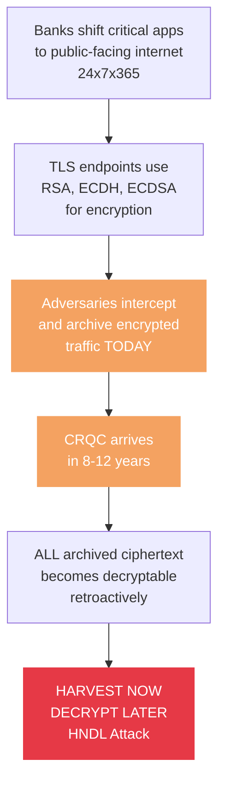

> **Problem Description:** Banks have moved critical applications to public-facing internet infrastructure. These applications use TLS, which relies on RSA, ECDH, and ECDSA for encryption and authentication. All three of these algorithms are broken by Shor's algorithm on a sufficiently powerful quantum computer. Adversaries do not need to wait for quantum computers — they are intercepting and archiving encrypted banking traffic today. When a Cryptanalytically Relevant Quantum Computer (CRQC) arrives, estimated within 8–12 years based on IBM and Google qubit roadmaps, all previously archived ciphertext becomes retroactively decryptable. This is the Harvest Now, Decrypt Later (HNDL) attack. The core problem is that banks have no automated tooling to discover which public assets are exposed, measure the severity of exposure, estimate when each asset becomes decryptable, or generate deployment-ready fixes.

**Who is affected:** Every bank with public-facing APIs, web servers, and VPN endpoints — and every customer whose financial data is encrypted with classical cryptography today.

**What banks currently lack:**
- No automated discovery of which assets use quantum-vulnerable cryptography
- No structured Cryptographic Bill of Materials (CBOM)
- No evidence-based timeline for when each asset becomes decryptable
- No deployment-ready PQC configuration patches

---

## 3. Cryptographic Threat Model

This is the most technically critical section. Understanding *exactly* what quantum computers break — and what they don't — is the foundation of the entire platform.

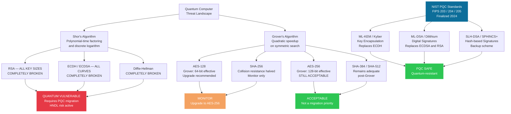

> **Threat Model Description:** There are two distinct quantum algorithms that threaten cryptography, and they do not threaten the same things. Shor's algorithm operates in polynomial time and completely solves integer factorization and discrete logarithm problems. This means it fully breaks RSA (all key sizes), ECDH (all elliptic curves), ECDSA (all curves), and Diffie-Hellman. These algorithms underpin TLS key exchange and certificate authentication — the mechanisms protecting every HTTPS connection. Grover's algorithm provides only a quadratic speedup on unstructured search. Applied to symmetric encryption, it effectively halves the security level: AES-128 drops to 64-bit effective security (upgrade recommended), but AES-256 drops to only 128-bit effective security, which remains entirely acceptable by modern standards. AES-256 is NOT broken by quantum computers and is NOT a migration priority — this is one of the most common errors in competing solutions. The NIST Post-Quantum Cryptography standards (finalized August 2024) provide the replacements: ML-KEM (FIPS 203) replaces ECDH for key encapsulation, ML-DSA (FIPS 204) replaces ECDSA and RSA for digital signatures, and SLH-DSA (FIPS 205) is a hash-based backup signature scheme.

### Critical Distinction: AES-256 Is NOT Quantum-Broken

| Algorithm | Quantum Threat | Quantum Algorithm | Status |
|---|---|---|---|
| RSA-2048 | **BROKEN** — Shor solves factoring in polynomial time | Shor's | 🔴 Migrate now |
| ECDH (all curves) | **BROKEN** — Shor solves discrete log | Shor's | 🔴 Migrate now |
| ECDSA | **BROKEN** — certificate forgery possible | Shor's | 🔴 Migrate now |
| AES-128 | **Weakened** — Grover halves to 64-bit effective | Grover's | 🟠 Upgrade to AES-256 |
| AES-256 | **Acceptable** — Grover → 128-bit effective, still secure | Grover's | 🟢 Not a priority |
| SHA-256 | **Weakened** — Grover halves collision resistance | Grover's | 🟠 Monitor |
| SHA-384/512 | **Acceptable** post-Grover | Grover's | 🟢 Not a priority |
| ML-KEM-768 | **Resistant** — NIST FIPS 203 | N/A | 🟢 PQC Safe |
| ML-DSA-65 | **Resistant** — NIST FIPS 204 | N/A | 🟢 PQC Safe |

> **Most competing solutions incorrectly flag AES-256 as a quantum emergency. Aegis does not. This is the first thing an expert judge will test.**

---

## 4. Solution Overview

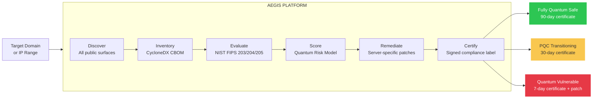

> **Solution Pipeline Description:** Aegis processes a target domain or IP range through six sequential stages. Stage 1 — Discover: the platform enumerates all public-facing assets using DNS enumeration, certificate transparency logs, and port scanning across TCP and UDP. Stage 2 — Inventory: every discovered asset's cryptographic configuration is captured and structured into a CycloneDX 1.6 Cryptographic Bill of Materials (CBOM), stored in PostgreSQL. Stage 3 — Evaluate: a deterministic boolean rules engine compares each CBOM entry against NIST FIPS 203 (ML-KEM), FIPS 204 (ML-DSA), and FIPS 205 (SLH-DSA) compliance requirements. No AI or probabilistic system is involved in this decision. Stage 4 — Score: a weighted quantum risk formula (described in Section 8) produces a numeric score from 0 to 100 per asset, with component-level breakdown. Stage 5 — Remediate: for assets that fail evaluation, a RAG pipeline (Dify + Qdrant) generates a server-type-specific PQC configuration patch and an evidence-backed HNDL break timeline. Stage 6 — Certify: every asset receives a cryptographically signed X.509 compliance certificate in one of three tiers: Fully Quantum Safe (90-day validity), PQC Transitioning (30-day validity), or Quantum Vulnerable (7-day validity with remediation bundle attached).

---

## 5. System Architecture

```mermaid
graph TB
    subgraph INPUT_LAYER["INPUT LAYER"]
        UI[Security Analyst<br>Next.js Dashboard]
        CLI[CLI / REST API]
        SCHED[Scheduler<br>Continuous Monitoring]
    end

    subgraph L1["LAYER 1 — DISCOVERY ENGINE"]
        DNS[DNS Enumeration<br>Amass + DNSx<br>Certificate transparency logs]
        PORT[Port Scanner<br>Nmap TCP+UDP<br>443 8443 4443 500 4500]
        TLS_PROBE[TLS ClientHello Probe<br>Force cipher negotiation<br>Extract server preferences]
        API_PROBE[API Surface Inspector<br>JWT alg header<br>mTLS detection — optional]
        VPN_PROBE[VPN Endpoint Detector<br>IKEv2 SA proposals<br>Partial analysis]
    end

    subgraph L2["LAYER 2 — CRYPTOGRAPHIC ANALYSIS ENGINE"]
        PARSE[Cipher Suite Parser<br>kex / auth / enc / mac<br>Regex decomposition]
        CERT[Certificate Chain Analyzer<br>Leaf + Intermediate + Root<br>Algorithm and key size]
        SCORE[Quantum Risk<br>Scoring Engine<br>Weighted formula]
        CLASSIFY[PQC Classification<br>Boolean deterministic<br>rules engine]
    end

    subgraph L3["LAYER 3 — CBOM GENERATION"]
        MAP[CycloneDX 1.6<br>Schema Mapper<br>cryptoProperties]
        DB[(PostgreSQL<br>CBOM Store<br>Audit log)]
        EXPORT[CBOM Export<br>JSON and PDF]
    end

    subgraph L4["LAYER 4 — THREAT INTELLIGENCE RAG"]
        DIFY[Dify Workflow<br>Orchestration]
        QDRANT[(Qdrant<br>Vector DB<br>NIST docs)]
        HNDL_CALC[HNDL Timeline<br>Calculator<br>BreakYear formula]
        PATCH[Patch Generator<br>nginx / Apache<br>OpenSSL config]
    end

    subgraph L5["LAYER 5 — CERTIFICATION ENGINE"]
        EVAL[PQC Compliance<br>Evaluator]
        SIGNER[X.509 Certificate<br>Signer<br>ML-DSA-65 via liboqs]
        LABEL[Three-Tier<br>Label Issuer]
    end

    subgraph OUTPUT_LAYER["OUTPUT LAYER"]
        DASH[Security Dashboard<br>Risk Heatmap]
        REPORT[Dual Reports<br>CISO + Engineer view]
        CERTVIEW[Certificate Viewer<br>and Verifier]
    end

    INPUT_LAYER --> L1
    L1 --> L2
    L2 --> L3
    L3 --> L4
    L3 --> L5
    L4 --> OUTPUT_LAYER
    L5 --> OUTPUT_LAYER
```

> **System Architecture Description:** Aegis is organized into seven logical layers. The Input Layer accepts scan requests from a Next.js web dashboard, a REST API, or a scheduler for continuous monitoring. Layer 1 (Discovery Engine) takes the target and produces a list of live, public-facing cryptographic surfaces using Amass and DNSx for DNS enumeration, and Nmap for port scanning across TCP 443/8443/4443 and UDP 500/4500. A TLS ClientHello probe with a full cipher offering is sent to each surface to force server preference disclosure. An optional API surface inspector reads JWT Authorization headers to extract algorithm declarations. VPN detection provides partial analysis only. Layer 2 (Cryptographic Analysis Engine) decomposes the negotiated cipher suite into four independent components (key exchange, authentication, encryption, integrity), analyzes the certificate chain including leaf, intermediate, and root certificates, computes the quantum risk score, and runs the PQC classification logic. Layer 3 (CBOM Generation) maps all collected data into a CycloneDX 1.6-compliant JSON document with a cryptoProperties schema and stores it in PostgreSQL. Layers 4 and 5 run in parallel after CBOM generation: Layer 4 (Threat Intelligence RAG) uses Dify as a workflow orchestrator querying Qdrant's NIST document embeddings to generate HNDL timelines and server-specific patches for vulnerable assets; Layer 5 (Certification Engine) uses the deterministic compliance evaluation to issue a signed X.509 certificate. The Output Layer surfaces all results through the dashboard, dual CISO and engineer report views, and a certificate verifier.

---

## 6. Data Flow

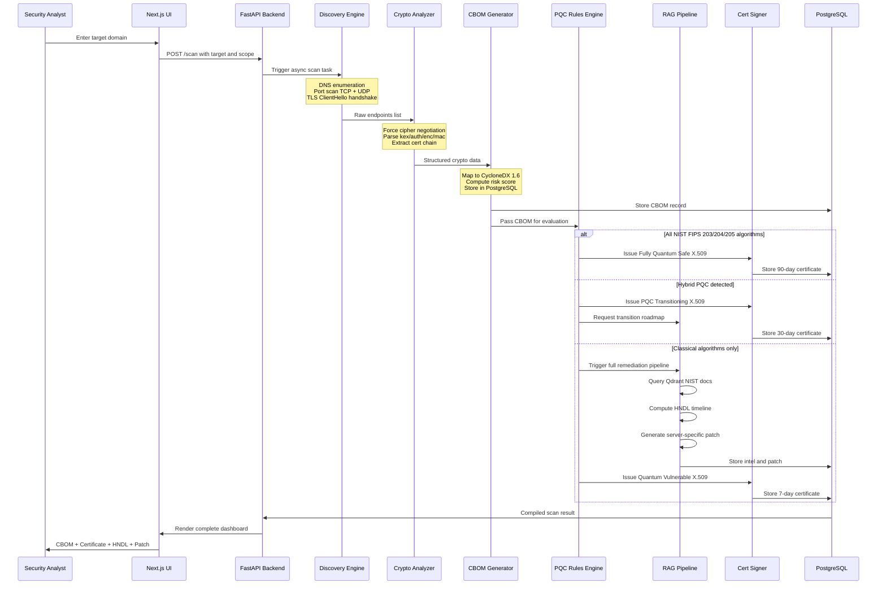

> **Data Flow Description:** A scan is initiated when the analyst submits a target domain via the Next.js UI. The UI sends a POST /scan request to the FastAPI backend, which spawns an async scan task. The Discovery Engine performs DNS enumeration and port scanning, then sends a TLS ClientHello to discovered endpoints to force cipher negotiation. The Crypto Analyzer receives raw endpoint data, parses the cipher suite into components, and extracts the full certificate chain. The CBOM Generator maps this into CycloneDX 1.6 JSON and writes it to PostgreSQL. The PQC Rules Engine receives the CBOM and branches into one of three paths: if all algorithms pass NIST FIPS 203/204/205 checks, a Fully Quantum Safe certificate with 90-day validity is issued directly; if hybrid PQC implementations are detected with no classical-only failures, a PQC Transitioning certificate with 30-day validity is issued and a transition roadmap is requested from the RAG pipeline; if any classical algorithm is detected in a security-critical role (key exchange or signature), the full RAG pipeline is triggered — Dify queries Qdrant for NIST document context, computes the HNDL break year using the `RequiredLogicalQubits / ProjectedQubitGrowthRate` formula, generates a server-specific PQC configuration patch, stores all artifacts in PostgreSQL, and a Quantum Vulnerable certificate with 7-day validity is issued. The final assembled result (CBOM, certificate, HNDL timeline, patch) is returned to the dashboard.

---

## 7. Module Deep-Dives

### 7.1 Discovery Engine

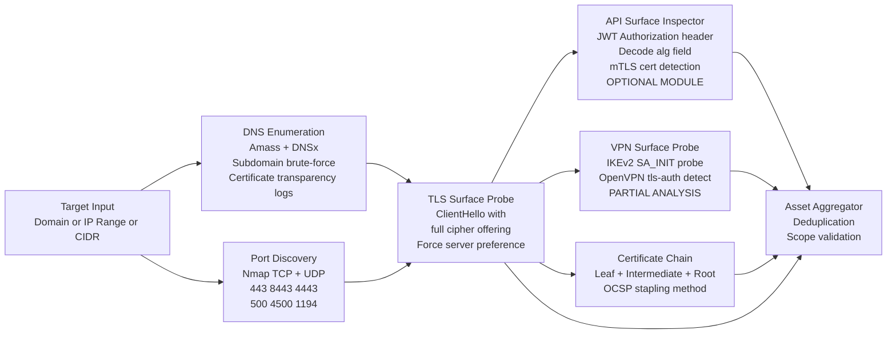

> **Discovery Engine Description:** The discovery engine takes a domain name, IP address, or CIDR range as input and produces a deduplicated list of live cryptographic surfaces. It runs two parallel tracks. Track 1 is DNS-based: Amass performs subdomain enumeration using brute-force wordlists and certificate transparency log queries; DNSx resolves each discovered subdomain to verify it is live. Track 2 is port-based: python-nmap scans TCP ports 443, 8443, and 4443 for HTTPS/TLS endpoints, and UDP ports 500 and 4500 for IKEv2 VPN endpoints, and TCP 1194 for OpenVPN. Both tracks feed into a TLS ClientHello Probe that sends a full cipher suite offering to each surface, forcing the server to reveal its preferred algorithm set and certificate chain. Three additional inspectors branch from the TLS probe: the API Surface Inspector is an optional module that reads JWT Authorization Bearer tokens from accessible API responses and decodes the header's `alg` field to identify the signature algorithm in use; the VPN Surface Probe attempts IKEv2 SA_INIT and OpenVPN handshake detection but is scoped as partial analysis because many VPN servers block unauthenticated external probes; the Certificate Chain extractor retrieves the leaf, intermediate, and root certificates with their full metadata. All results converge in the Asset Aggregator, which deduplicates entries and validates each against the authorized scan scope.

**Scope honesty:** TLS endpoints on ports 443/8443 are fully implemented. VPN scanning provides detection and partial analysis only — many VPN servers do not expose cryptographic proposals to unauthenticated external probes. JWT inspection is an optional module activated only when accessible endpoints return Authorization headers.

### 7.2 Cipher Suite Parser

The parser is the most technically critical component. It programmatically decomposes every TLS cipher string into four independent components and maps each to its correct quantum threat axis.

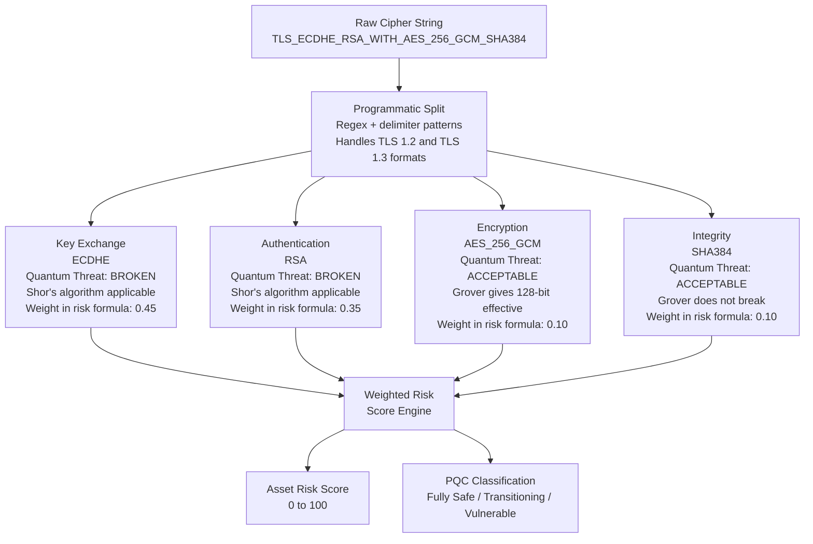

> **Cipher Parser Description:** The cipher suite parser receives a raw TLS cipher string such as `TLS_ECDHE_RSA_WITH_AES_256_GCM_SHA384` and uses regex combined with a known delimiter pattern to split it into exactly four components: key exchange (ECDHE), authentication (RSA), encryption (AES_256_GCM), and integrity/MAC (SHA384). For TLS 1.3 cipher strings such as `TLS_AES_256_GCM_SHA384`, which omit the key exchange and authentication fields (these are negotiated separately in TLS 1.3), the parser handles both formats. Each extracted component is mapped against a vulnerability lookup table that assigns it a quantum threat classification and a vulnerability value (V) on a scale of 0.00 to 1.00. The key exchange ECDHE maps to V=1.00 because Shor's algorithm completely breaks elliptic curve Diffie-Hellman. RSA authentication maps to V=1.00 because Shor's breaks integer factorization. AES_256_GCM maps to V=0.05 because Grover's algorithm reduces it from 256-bit to 128-bit effective security, which remains acceptable. SHA384 maps to near-zero risk. These four values feed into the weighted risk scoring formula.

---

## 8. Risk Scoring Model

> **Risk Scoring Model Description:** The quantum risk score is a single numeric value between 0 and 100 that represents the overall quantum attack surface of one scanned asset. It is computed from four independently weighted components corresponding to the four cryptographic roles in a TLS connection: key exchange (V_kex), signature/authentication (V_sig), symmetric encryption (V_sym), and TLS version (V_tls). Each component receives a vulnerability value V between 0.00 and 1.00 based on the specific algorithm detected and its known quantum threat exposure. The weights — 0.45 for key exchange, 0.35 for signature, 0.10 for symmetric, 0.10 for TLS version — reflect the relative severity of quantum threats across these roles. Key exchange carries the highest weight because Shor's algorithm completely eliminates its security guarantee (V=1.00 for all classical KEX). Signature carries the second highest weight because a forged signature undermines the entire certificate trust chain. Symmetric encryption carries only 0.10 weight because Grover's algorithm does not break AES-256 — it merely halves its effective bit-security from 256 to 128 bits, which is still acceptable. A score of 0 means fully quantum-safe; a score of 100 means every component uses the most broken classical algorithms. Scores above 70 map to QUANTUM_VULNERABLE tier; scores between 30 and 70 with hybrid algorithms present map to PQC_TRANSITIONING; scores below 30 with all NIST-approved algorithms map to FULLY_QUANTUM_SAFE.

### Formula

```
QuantumRiskScore = (0.45 × V_kex) + (0.35 × V_sig) + (0.10 × V_sym) + (0.10 × V_tls)
```

The weights reflect actual quantum threat surfaces — they are not arbitrary:

| Component | Weight | Rationale |
|---|---|---|
| Key Exchange (`V_kex`) | **0.45** | Shor's completely breaks all classical KEX — the highest quantum priority |
| Signature (`V_sig`) | **0.35** | Shor's breaks RSA/ECDSA signatures — enables certificate forgery |
| Symmetric (`V_sym`) | **0.10** | Grover weakens but does NOT break AES-256 — correctly deprioritized |
| TLS Version (`V_tls`) | **0.10** | TLS 1.0/1.1 have structural weaknesses beyond quantum |

### Vulnerability Values

| Algorithm | V_kex | V_sig | V_sym | Notes |
|---|---|---|---|---|
| RSA key transport | 1.00 | — | — | Completely broken by Shor |
| ECDH (all curves) | 1.00 | — | — | Completely broken by Shor |
| DHE (all groups) | 1.00 | — | — | Completely broken by Shor |
| X25519 + ML-KEM (hybrid) | 0.30 | — | — | Classical component broken; PQC safe |
| ML-KEM-512/768/1024 | 0.00 | — | — | NIST FIPS 203 — quantum safe |
| RSA signature | — | 1.00 | — | Completely broken by Shor |
| ECDSA (all curves) | — | 1.00 | — | Completely broken by Shor |
| ML-DSA-44/65/87 | — | 0.00 | — | NIST FIPS 204 — quantum safe |
| SLH-DSA | — | 0.00 | — | NIST FIPS 205 — quantum safe |
| AES-128 | — | — | 0.50 | Grover → 64-bit effective |
| AES-256 / AES-256-GCM | — | — | 0.05 | Grover → 128-bit — still acceptable |
| 3DES / DES / RC4 | — | — | 1.00 | Classically broken |

### Example Calculation

```
Asset: api.pnb.com
  Key Exchange: ECDHE          → V_kex = 1.00  (Shor-broken)
  Signature:    RSA-2048        → V_sig = 1.00  (Shor-broken)
  Encryption:   AES-256-GCM    → V_sym = 0.05  ← NOT scored as broken
  TLS Version:  1.2             → V_tls = 0.40

  Risk = (0.45 × 1.00) + (0.35 × 1.00) + (0.10 × 0.05) + (0.10 × 0.40)
       = 0.45 + 0.35 + 0.005 + 0.04
       = 0.845 → Score: 84.5 / 100 → Status: QUANTUM VULNERABLE
```

---

## 9. PQC Compliance Engine

The compliance engine is **fully deterministic** — no LLM or probabilistic output influences risk scores, compliance tier, or certificate issuance. Security cannot hallucinate.

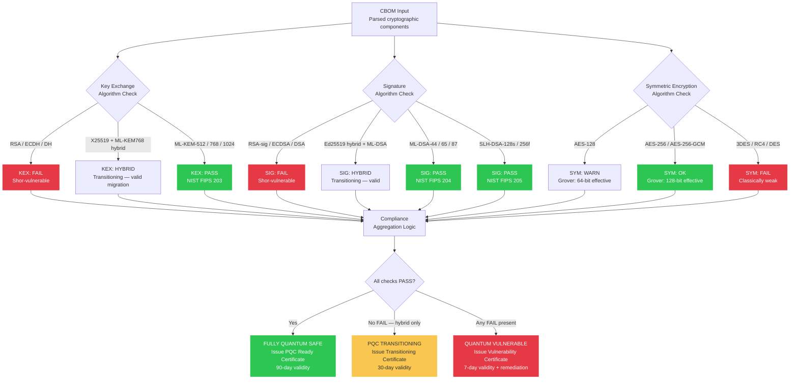

> **FPQC Compliance Engine Description:** The compliance engine is the security core of Aegis and is architecturally isolated from all AI components. It is a purely deterministic boolean rules engine — no LLM, no probabilistic system, and no human judgment is involved in its decisions. The engine receives a parsed CBOM and checks three independent dimensions. For key exchange: RSA key transport, ECDH on any elliptic curve, and any DHE group all return FAIL because Shor's algorithm completely breaks them; a hybrid combination of X25519 with ML-KEM-768 returns HYBRID because the classical component is broken but the PQC component provides quantum protection; pure ML-KEM-512, ML-KEM-768, or ML-KEM-1024 (NIST FIPS 203) return PASS. For signatures: RSA signatures, ECDSA on any curve, and DSA all return FAIL; an Ed25519 hybrid combined with ML-DSA returns HYBRID; pure ML-DSA-44, ML-DSA-65, or ML-DSA-87 (NIST FIPS 204) and SLH-DSA variants (NIST FIPS 205) return PASS. For symmetric encryption: 3DES, RC4, and DES return FAIL due to classical weakness; AES-128 returns WARN due to Grover's reducing it to 64-bit effective security; AES-256 and AES-256-GCM return OK because Grover's reduction to 128-bit effective security is still acceptable. The aggregation logic combines all flags: if all three dimensions are PASS, the tier is FULLY_QUANTUM_SAFE; if no FAIL flags exist but HYBRID flags are present, the tier is PQC_TRANSITIONING; if any FAIL flag exists in the key exchange or signature dimensions, the tier is QUANTUM_VULNERABLE regardless of other results.

---

## 10. HNDL Timeline Intelligence

Rather than asserting "8–12 years" generically, Aegis computes a **per-asset HNDL break year** using a deterministic formula grounded in published qubit roadmaps.

### Formula

```
BreakYear = CurrentYear + (RequiredLogicalQubits_algorithm / ProjectedQubitGrowthRate_roadmap)
```

### Algorithm-Specific Data

| Algorithm | Required Logical Qubits | IBM Growth Rate | Estimated Break Year |
|---|---|---|---|
| RSA-2048 | ~4,000 | ~400/year | ~2036 |
| ECDH P-256 | ~2,330 | ~400/year | ~2032 |
| RSA-4096 | ~8,000 | ~400/year | ~2046 |
| AES-128 (Grover) | N/A (no polynomial break) | — | Not applicable |
| ML-KEM-768 | No known quantum break | — | PQC Safe |

**Source attribution:** All qubit growth rates are sourced from IBM Quantum Roadmap, Google Qubit Projections, and NIST IR 8547, loaded into Qdrant and cited in every HNDL report.

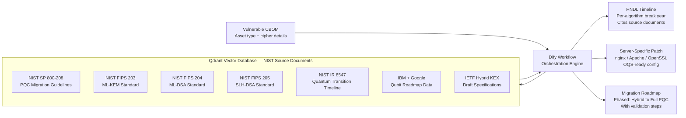

> **HNDL Timeline and RAG Pipeline Description:** When an asset is classified as QUANTUM_VULNERABLE, the platform triggers a Dify workflow that computes a per-asset HNDL break timeline and generates server-specific remediation. The HNDL break year is calculated using the formula `BreakYear = CurrentYear + (RequiredLogicalQubits_algorithm / ProjectedQubitGrowthRate_roadmap)`. The required logical qubit counts are drawn from peer-reviewed literature: RSA-2048 requires approximately 4,000 logical qubits, ECDH P-256 requires approximately 2,330 logical qubits. The projected qubit growth rate of approximately 400 logical qubits per year is sourced from IBM Quantum Roadmap projections and Google qubit growth data, both of which are stored as embeddings in Qdrant and retrieved with source attribution in every output. This gives RSA-2048 an estimated break year of approximately 2036 and ECDH P-256 approximately 2032. The Qdrant vector database holds embeddings of seven authoritative source documents: NIST SP 800-208 (PQC migration guidelines), NIST FIPS 203 (ML-KEM standard), NIST FIPS 204 (ML-DSA standard), NIST FIPS 205 (SLH-DSA standard), NIST IR 8547 (quantum transition timelines), IBM and Google qubit roadmap data, and IETF hybrid KEX draft specifications. Dify orchestrates three outputs from each query: an HNDL timeline citing the relevant source documents, a server-specific PQC configuration patch tailored to the detected server type (nginx, Apache, or OpenSSL CLI), and a phased migration roadmap that walks through hybrid deployment first and then full PQC replacement. The RAG pipeline is strictly limited to these three outputs — it has no write access to risk scores, compliance tier decisions, or certificate content.

---

## 11. Three-Tier Certification System

The certification system reflects the reality of PQC migration — binary safe/unsafe labels fail because banks will be in **hybrid transition for years**. The three-tier model captures this.

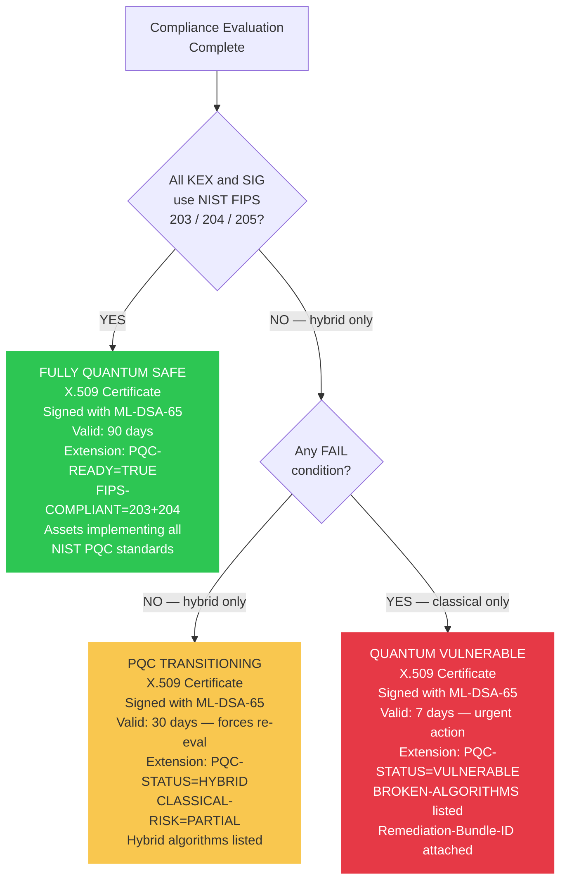

> **Three-Tier Certification Description:** The certification system produces one X.509 certificate per scanned asset, where the certificate's tier, validity window, and embedded metadata are determined entirely by the compliance engine's deterministic output. Tier 1 — FULLY_QUANTUM_SAFE: issued when every key exchange and signature algorithm passes NIST FIPS 203 and FIPS 204 checks. The certificate carries a 90-day validity window, includes OID extensions `PQC-READY=TRUE` and `FIPS-COMPLIANT=203+204`, and the certificate itself is signed using ML-DSA-65 via liboqs, meaning the certificate's own signature is quantum-safe. Tier 2 — PQC_TRANSITIONING: issued when hybrid PQC implementations are detected (for example X25519+ML-KEM-768 for key exchange, Ed25519+ML-DSA for signatures) and no classical-only failures exist. The certificate has a 30-day validity window — a shorter window than Tier 1 to force re-evaluation and incentivize completing the full migration. Extensions include `PQC-STATUS=HYBRID` and `CLASSICAL-RISK=PARTIAL` with the hybrid algorithm list. This tier explicitly recognizes that hybrid deployment is a legitimate and recommended intermediate migration step, not a failure state. Tier 3 — QUANTUM_VULNERABLE: issued when any key exchange or signature algorithm is classical-only (RSA, ECDH, ECDSA, DH). The certificate has a 7-day validity window to force immediate operational attention. Extensions include `PQC-STATUS=VULNERABLE` with a list of the broken algorithms, and a `Remediation-Bundle-ID` field that links to the associated HNDL timeline and patch bundle stored in PostgreSQL. The primary certificate signing method is ML-DSA-65 via OQS OpenSSL subprocess invocation from Python. If this is unavailable, the fallback is an ECDSA-signed X.509 certificate with the same custom OID extensions — the compliance evidence in the extensions is preserved regardless of which signing method is used.

**Why short expiry windows matter:** A 7-day certificate for a vulnerable asset is not punitive — it enforces operational urgency and prevents a "scan once, forget" culture. Banks are required to continuously re-prove their compliance posture, not just pass once.

**Certificate signing:** Primary method uses ML-DSA-65 via OQS OpenSSL subprocess (liboqs). Fallback uses ECDSA-signed X.509 with custom `PQC-STATUS` OID extensions — compliance evidence is preserved regardless of the signing algorithm used.

---

## 12. CBOM Standard

Aegis generates a **CycloneDX 1.6-compliant CBOM** — not a flat text report. This is a machine-readable, enterprise-importable artifact that feeds directly into GRC (Governance, Risk, Compliance) systems.

> **CBOM Description:** A Cryptographic Bill of Materials (CBOM) is a structured inventory of every cryptographic asset associated with a scanned service, analogous to a Software Bill of Materials (SBOM) but scoped to cryptographic algorithms, keys, protocols, and certificates. Aegis generates CBOMs in the CycloneDX 1.6 format, which is the OWASP-maintained standard that added native `cryptoProperties` support in its 1.6 release. Each CBOM document is scoped to a single scanned asset (identified by hostname and port), contains one component entry per cryptographic surface, and includes: the negotiated TLS protocol version, the full cipher suite string, decomposed fields for key exchange algorithm, authentication algorithm, encryption algorithm, and integrity algorithm, plus certificate metadata including the public key algorithm, key size in bits, signature algorithm, and a boolean `quantumSafe` flag. A top-level `quantumRiskSummary` block contains the overall numeric risk score (0–100), the compliance tier string (QUANTUM_VULNERABLE, PQC_TRANSITIONING, or FULLY_QUANTUM_SAFE), the HNDL urgency classification, the estimated break year for the most vulnerable algorithm in use, and a list of priority migration actions. The CBOM is stored as JSONB in PostgreSQL, is downloadable as JSON from the dashboard, and is structured to be directly importable into enterprise GRC platforms such as Archer, ServiceNow, or custom compliance tooling. The `serialNumber` field uses a deterministic URN scheme (`urn:uuid:aegis-scan-{date}-{hostname}`) to enable deduplication and historical diff tracking across repeated scans of the same asset.

```json
{
  "bomFormat": "CycloneDX",
  "specVersion": "1.6",
  "serialNumber": "urn:uuid:aegis-scan-20260312-api-pnb-com",
  "metadata": {
    "timestamp": "2026-03-12T10:30:00Z",
    "tools": [{ "name": "Aegis", "version": "1.0.0" }],
    "component": { "type": "service", "name": "api.pnb.com" }
  },
  "components": [
    {
      "type": "cryptographic-asset",
      "bom-ref": "tls-api-pnb-com-443",
      "cryptoProperties": {
        "assetType": "protocol",
        "tlsProperties": {
          "version": "1.2",
          "cipherSuites": ["TLS_ECDHE_RSA_WITH_AES_256_GCM_SHA384"],
          "keyExchange": "ECDHE",
          "authentication": "RSA-2048",
          "encryption": "AES-256-GCM",
          "integrity": "SHA-384"
        },
        "certificateProperties": {
          "subjectPublicKeyAlgorithm": "RSA",
          "subjectPublicKeySize": 2048,
          "signatureAlgorithm": "SHA256withRSA",
          "quantumSafe": false
        }
      }
    }
  ],
  "quantumRiskSummary": {
    "overallScore": 84.5,
    "tier": "QUANTUM_VULNERABLE",
    "hndlUrgency": "HIGH",
    "estimatedBreakYear": 2036,
    "priorityActions": ["migrate-key-exchange", "migrate-signature-algorithm"]
  }
}
```

---

## 13. Remediation Engine

Every remediation patch is **asset-type-aware** and contains **actual PQC directives** — not generic TLS 1.3 advice.

> **Remediation Engine Description:** The remediation engine generates server-specific configuration patches that are directly deployable — not conceptual advice. The key distinction between Aegis patches and generic PQC guidance is the presence of OQS-specific directives. For nginx, the critical directive is `ssl_ecdh_curve X25519MLKEM768:X25519` — this is not a standard nginx or OpenSSL directive. It requires OpenSSL to be compiled with the OQS provider (Open Quantum Safe project), which adds support for post-quantum key exchange groups. `X25519MLKEM768` is the hybrid group combining X25519 (classical Diffie-Hellman) with ML-KEM-768 (NIST FIPS 203), providing protection against both classical and quantum attacks simultaneously. The fallback `X25519` entry ensures backward compatibility with clients that do not yet support PQC. For certificate signing, Aegis generates directives to load an ML-DSA-65 certificate and key pair (NIST FIPS 204), generated using `openssl genpkey -algorithm ml-dsa-65` — again requiring OQS-patched OpenSSL. Critically, the AES-256-GCM cipher suite entry in the generated config is left unchanged, because AES-256-GCM is quantum-acceptable and does not require replacement. For Apache servers, the equivalent directive is `SSLOpenSSLConfCmd Curves X25519MLKEM768`. All generated patches include a header comment noting the OQS provider requirement, so engineers know the prerequisite. The RAG pipeline ensures patches cite the specific NIST FIPS section and IETF draft that the configuration implements.

### Correct nginx PQC Configuration (Generated by Aegis)

```nginx
# Aegis Generated — PQC Hybrid Configuration
# Asset: api.pnb.com | Score: 84.5 | Generated: 2026-03-12
# Requires: OpenSSL 3.x with OQS provider compiled from source

server {
    listen 443 ssl;
    server_name api.pnb.com;

    # Step 1: TLS 1.3 only — required for hybrid PQC
    ssl_protocols TLSv1.3;

    # Step 2: Hybrid PQC key exchange
    # X25519MLKEM768 = X25519 (classical) + ML-KEM-768 (NIST FIPS 203)
    # Protects against quantum AND provides classical fallback
    ssl_ecdh_curve X25519MLKEM768:X25519;

    # Step 3: Replace RSA cert with ML-DSA-65 (NIST FIPS 204)
    # Generate with: openssl genpkey -algorithm ml-dsa-65
    ssl_certificate     /etc/ssl/pqc/api.pnb.com.mldsa65.crt;
    ssl_certificate_key /etc/ssl/pqc/api.pnb.com.mldsa65.key;

    # Step 4: AES-256-GCM is quantum-acceptable — no change needed
    ssl_ciphers TLS_AES_256_GCM_SHA384:TLS_CHACHA20_POLY1305_SHA256;

    # Step 5: HSTS enforcement
    add_header Strict-Transport-Security "max-age=31536000; includeSubDomains" always;
}
```

> Note: `ssl_ecdh_curve X25519MLKEM768` is NOT the same as standard TLS 1.3. It requires an OQS-provider-patched OpenSSL build. This is the actual hybrid PQC directive — not a generic config.

---

## 14. Technology Stack

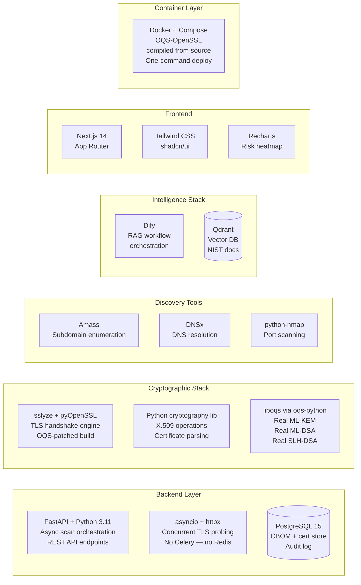

> **Technology Stack Description:** The backend is built on FastAPI with Python 3.11, using native asyncio and httpx for concurrent TLS probing. This eliminates the need for a message broker like Celery or Redis — asyncio coroutines handle up to 50 concurrent TLS handshakes natively, which is sufficient for hackathon-scale scanning. The TLS scanning layer uses sslyze and pyOpenSSL, but both must run inside a Docker container that has been built with a custom OpenSSL compiled from source against the OQS (Open Quantum Safe) provider. This is a hard requirement: standard pip-installable pyOpenSSL cannot negotiate PQC cipher suites because the system OpenSSL does not include quantum-safe algorithm support. The cryptographic operations layer uses liboqs via the oqs-python binding to perform real ML-KEM key encapsulation, real ML-DSA signature generation, and real SLH-DSA operations. These are not simulated or mocked — they are the reference implementations maintained by the Open Quantum Safe project and used by NIST in the standardization process. Asset discovery uses Amass for subdomain enumeration, DNSx for DNS resolution and validation, and python-nmap for port scanning. The intelligence layer uses Dify as a visual workflow orchestrator to manage the multi-step RAG pipeline, backed by a Qdrant vector database holding embeddings of NIST source documents. Dify was chosen over alternatives like LangChain because it provides an auditable visual workflow that makes the AI pipeline's behavior transparent and inspectable — important in a banking security context. The n8n orchestrator was explicitly rejected because it routes data through external webhook nodes, which is inappropriate for sensitive cryptographic asset data. The frontend uses Next.js 14 with the App Router, Tailwind CSS with shadcn/ui components, and Recharts for the risk heatmap visualization. The entire platform is deployable with a single `docker-compose up` command — the Dockerfile compiles OpenSSL 3.x with the OQS provider from source, which takes approximately 15 minutes on first build but produces a self-contained image that requires no host-level dependencies.

---

## 16. Key Innovations

> **Key Innovations Summary:** Aegis has five technical differentiators from competing solutions. Innovation 1 is a mathematically correct quantum risk model: the risk formula assigns AES-256 a vulnerability weight of 0.05 (not 1.00), correctly reflecting that Grover's algorithm reduces AES-256 to 128-bit effective security rather than breaking it; this is the most common error in competing tools. Innovation 2 is four-surface asset discovery that covers TLS endpoints, API gateways via JWT alg header inspection, VPN endpoints via IKEv2 and OpenVPN detection, and full certificate chain analysis across leaf, intermediate, and root certificates — most tools cover only TLS endpoints. Innovation 3 is an evidence-backed per-asset HNDL timeline computed from `RequiredLogicalQubits / ProjectedQubitGrowthRate` using IBM and Google qubit roadmap data stored in Qdrant, producing a cited break year rather than a generic estimate. Innovation 4 is a three-tier certification system that recognizes hybrid PQC implementations (X25519+ML-KEM-768) as a valid PQC_TRANSITIONING state rather than a failure, matching the reality that banks cannot migrate overnight and need a recognized intermediate compliance tier. Innovation 5 is asset-type-aware patch generation that produces real, deployable OQS-provider-enabled nginx and Apache configurations with the actual `ssl_ecdh_curve X25519MLKEM768` directive and ML-DSA-65 certificate deployment instructions, not generic TLS 1.3 boilerplate.

### Innovation 1 — Mathematically Correct Quantum Risk Model
The risk formula correctly isolates quantum threat surfaces. AES-256 receives a weight of 0.05 — not 1.00. This reflects the actual physics: Grover's algorithm reduces AES-256 to 128-bit effective security, which remains acceptable. Every competing solution that scores AES-256 as a critical quantum vulnerability fails the most basic expert test.

### Innovation 2 — Four-Surface Asset Discovery
TLS endpoints (port 443/8443) + API gateways (JWT alg inspection) + VPN endpoints (IKEv2/OpenVPN detection) + Certificate chain analysis (leaf + intermediate + root algorithms). Most tools cover only surface 1.

### Innovation 3 — Evidence-Backed HNDL Timeline
Per-asset break year computed from `RequiredLogicalQubits / ProjectedQubitGrowthRate`, with qubit data sourced from IBM and Google roadmaps loaded into Qdrant. Not an assertion — a derivation.

### Innovation 4 — Three-Tier Certification
Binary safe/unsafe misses the migration reality. The `PQC Transitioning` tier correctly validates hybrid implementations (X25519+ML-KEM768) as a legitimate migration step, matching real-world banking deployment timelines.

### Innovation 5 — Asset-Type-Aware Patch Generation
nginx gets `ssl_ecdh_curve X25519MLKEM768`. Apache gets `SSLOpenSSLConfCmd Curves X25519MLKEM768`. Every patch targets OQS-provider-enabled OpenSSL and includes ML-DSA-65 certificate deployment directives. Not generic advice — deployable configurations.

---

## 17. Implementation Risks & Mitigations

| Risk | Severity | Mitigation |
|---|---|---|
| **OQS OpenSSL compilation** — `pip install oqs-python` alone does not enable PQC TLS; requires custom OpenSSL + OQS provider build | 🔴 Week 1 blocker | Dockerfile compiles OpenSSL 3.x + OQS provider from source on Day 1. All scanner code runs strictly inside this container. Never attempt PQC TLS on host OS OpenSSL. |
| **ML-DSA X.509 signing** — Python `cryptography` library does not natively support FIPS 204 ML-DSA (finalized August 2024) | 🟠 Week 3 risk | Primary: OQS OpenSSL CLI via Python `subprocess`. Fallback: ECDSA-signed X.509 + custom `PQC-STATUS` OID extensions. Compliance evidence is preserved either way. |
| **Scope creep** — 10+ modules create integration complexity | 🟠 Demo risk | Demo-day core is 6 modules: scan → parse → risk → CBOM → certificate → dashboard. VPN and JWT inspection are secondary features. |
| **VPN scanning overpromise** — many VPN servers block unauthenticated probes | 🟡 Framing risk | Positioned as "detection + partial analysis" — not full VPN cryptographic scanning. |
| **JWT inspection availability** — scanners rarely receive JWT tokens from target APIs | 🟡 Framing risk | Positioned as "optional module" dependent on accessible endpoints. |

---

## 18. Future Roadmap

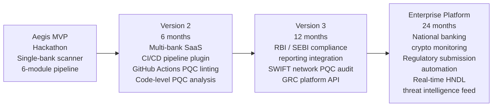

> **Future Roadmap Description:** The Aegis roadmap follows four phases. The hackathon MVP is a single-bank scanner covering the six-module core pipeline: TLS discovery, cipher parsing, risk scoring, CBOM generation, certificate issuance, and the remediation dashboard. Version 2 (target: 6 months post-hackathon) extends Aegis into a multi-bank SaaS deployment with per-tenant data isolation, adds a CI/CD pipeline plugin so developers can run PQC compliance checks at commit time in GitHub Actions or GitLab CI, and adds source-code-level PQC analysis that flags cryptographic library calls in application code that use deprecated algorithms. Version 3 (target: 12 months) integrates with RBI and SEBI compliance reporting frameworks, adds a SWIFT network PQC readiness audit module for inter-bank communication channels, and exposes a GRC platform API so Archer, ServiceNow, and custom compliance tooling can pull CBOM and certificate data directly. The Enterprise Platform (target: 24 months) becomes a national banking cryptographic monitoring backbone — providing real-time HNDL threat intelligence feeds based on the latest qubit development news, automating regulatory submission artifacts for PQC migration evidence, and offering a continuous compliance posture dashboard across the entire Indian banking sector. The regulatory driver for this timeline is NIST IR 8547, which recommends that organizations complete PQC migration by 2035 — giving Aegis a clear 9-year window in which demand for this platform will only increase.

### Real-World Impact

A platform like Aegis deployed nationally could:
- **Reduce HNDL attack surface** across India's banking sector by providing a standardized PQC readiness benchmark
- **Accelerate PQC migration** by eliminating the discovery phase — banks currently don't know what they have
- **Enable regulatory compliance** as RBI and global regulators begin mandating PQC readiness timelines (NIST IR 8547 recommends migration completion by 2035)
- **Provide audit evidence** — the signed CBOM and X.509 certificates create an immutable compliance record that regulators can verify independently

---

## Appendix — NIST PQC Algorithm Reference

| Standard | Algorithm | Security Level | Replaces | Quantum Safe |
|---|---|---|---|---|
| FIPS 203 | ML-KEM-512 | Level 1 (AES-128 equivalent) | ECDH P-256 | ✅ |
| FIPS 203 | ML-KEM-768 | Level 3 (AES-192 equivalent) | ECDH P-384 | ✅ |
| FIPS 203 | ML-KEM-1024 | Level 5 (AES-256 equivalent) | ECDH P-521 | ✅ |
| FIPS 204 | ML-DSA-44 | Level 2 | ECDSA P-256 | ✅ |
| FIPS 204 | ML-DSA-65 | Level 3 | ECDSA P-384 | ✅ |
| FIPS 204 | ML-DSA-87 | Level 5 | ECDSA P-521 | ✅ |
| FIPS 205 | SLH-DSA-128s | Level 1 | RSA-2048 (backup) | ✅ |
| FIPS 205 | SLH-DSA-256f | Level 5 | RSA-4096 (backup) | ✅ |

**Recommended migration path for banking:** ML-KEM-768 (key exchange) + ML-DSA-65 (signatures) — Level 3 security matches existing banking cryptographic standards and is supported by OpenSSL 3.4+ with OQS provider.

---

*Aegis — Quantum-Ready Cybersecurity for Future-Safe Banking*