# Aegis
## Quantum Cryptographic Intelligence Platform for Banking Infrastructure

> **"Don't just scan for vulnerabilities. Prove you are safe."**

---

> **Document Note:** This document describes the complete Aegis solution — architecture, scoring logic, pipeline, remediation engine, and technology decisions. Every diagram is followed by a plain-English explanation. All security decisions in this system are deterministic. No AI or LLM influences risk scores, compliance tiers, or certificate issuance. The platform name is **Aegis**. The core technical claim is that Aegis correctly separates Shor's algorithm threats (which completely break RSA, ECDH, ECDSA) from Grover's algorithm effects (which weaken but do not break AES-256).

---

## Table of Contents

1. [Executive Summary](#1-executive-summary)
2. [The Problem](#2-the-problem)
3. [Cryptographic Threat Model](#3-cryptographic-threat-model)
4. [Solution Overview](#4-solution-overview)
5. [System Architecture](#5-system-architecture)
6. [Data Flow](#6-data-flow)
7. [Scan Profiles](#7-scan-profiles)
8. [Discovery Engine](#8-discovery-engine)
9. [TLS Scanner and Cipher Parser](#9-tls-scanner-and-cipher-parser)
10. [Q-Score Model](#10-q-score-model)
11. [PQC Compliance Engine](#11-pqc-compliance-engine)
12. [HNDL Timeline Intelligence](#12-hndl-timeline-intelligence)
13. [Three-Tier Certification System](#13-three-tier-certification-system)
14. [CBOM Standard](#14-cbom-standard)
15. [Remediation Center](#15-remediation-center)
16. [Score Explanation Engine](#16-score-explanation-engine)
17. [Frontend Dashboard](#17-frontend-dashboard)
18. [Database Architecture](#18-database-architecture)
19. [Technology Stack](#19-technology-stack)
20. [CI/CD Pipeline](#20-cicd-pipeline)
21. [Security Architecture](#21-security-architecture)
22. [Scalability Design](#22-scalability-design)
23. [Key Innovations](#23-key-innovations)
24. [Future Roadmap](#24-future-roadmap)
25. [Appendix — NIST PQC Algorithm Reference](#25-appendix--nist-pqc-algorithm-reference)

---

## 1. Executive Summary

Banks today are accumulating **quantum debt** — every TLS handshake using RSA or ECDH generates interceptable ciphertext that adversaries are archiving right now, waiting for the day a Cryptanalytically Relevant Quantum Computer (CRQC) arrives to decrypt it retroactively. This is the **Harvest Now, Decrypt Later (HNDL)** attack vector, and it is not theoretical — it is operationally active right now.

**Aegis** is a continuous, autonomous Cryptographic Intelligence Platform that:

1. **Discovers** every public-facing cryptographic surface of a banking institution across web servers, APIs, and VPN endpoints
2. **Inventories** the complete cryptographic posture of each asset into a machine-readable **Cryptographic Bill of Materials (CBOM)** aligned to CycloneDX 1.6
3. **Evaluates** each asset against NIST FIPS 203 (ML-KEM), FIPS 204 (ML-DSA), and FIPS 205 (SLH-DSA)
4. **Labels** assets with a **three-tier certification** — Fully Quantum Safe, PQC Transitioning, or Quantum Vulnerable
5. **Explains** every score with a deterministic per-component breakdown showing exactly why an asset received its specific Q-Score
6. **Remediates** vulnerabilities with asset-type-aware, ready-to-deploy configuration patches grounded in authoritative NIST source documents
7. **Monitors** continuously — not a one-shot scanner, but a living cryptographic intelligence system

**Core design principles:**
- **Local-first default runtime** — scoring, classification, patch generation, roadmap text, and certificate issuance run on-premise inside Docker in the standard local mode
- **Fully deterministic security** — Q-Scores, compliance tiers, findings, and certificates are never influenced by any AI or probabilistic system
- **Fully local operation for the core pipeline** — Qdrant vector database and OQS-patched OpenSSL run inside the Docker stack; retrieval providers are configurable and local mode is the default
- **Auditable** — every scoring decision traces back to a specific formula component with a specific V value derived from a specific detected algorithm

---

## 2. The Problem

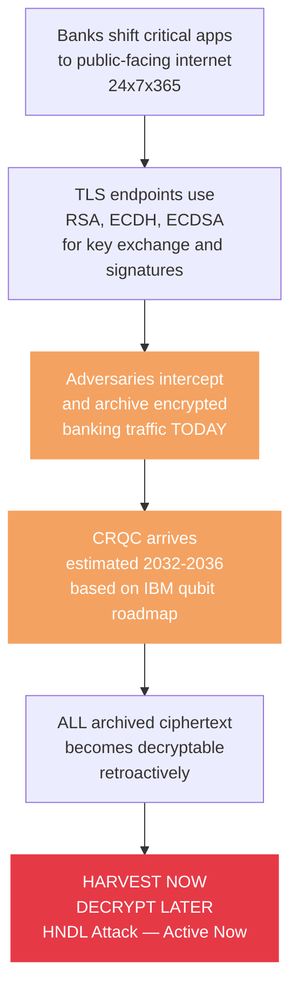

The threat is not in the future. Adversaries are collecting encrypted bank traffic today. The moment a quantum computer powerful enough to run Shor's algorithm exists, every archived TLS session becomes readable — customer credentials, transaction data, authentication tokens, everything.

**What banks currently lack:**
- No automated tool to discover which public-facing assets use quantum-vulnerable cryptography
- No structured Cryptographic Bill of Materials tracking what algorithms are in use where
- No evidence-based timeline for when each specific asset becomes decryptable
- No deployment-ready PQC configuration patches specific to their server type
- No human-readable explanation of what their risk score actually means

**Who is affected:** Every bank with public-facing web servers, APIs, and VPN endpoints. Every customer whose financial data is encrypted with RSA or ECDH today.

**Consequence if unresolved:** Retroactive decryption of years of customer financial data, complete compromise of digital banking infrastructure post-CRQC, and regulatory non-compliance as RBI and global bodies begin mandating PQC migration timelines.

---

## 3. Cryptographic Threat Model

There are two distinct quantum algorithms that threaten cryptography. They do not threaten the same things.

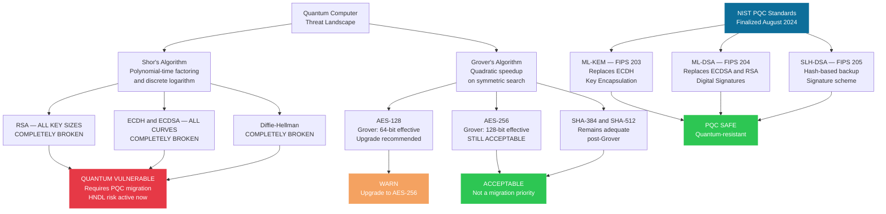

**The most critical distinction:** AES-256 is NOT quantum-broken. Grover's algorithm reduces AES-256 from 256-bit to 128-bit effective security — which remains entirely acceptable by modern standards. AES-256 is not a migration priority. Every competing solution that flags AES-256 as a quantum emergency fails the most basic expert review. Aegis scores AES-256 with V_sym = 0.05, not 1.00.

### Algorithm Threat Classification Table

| Algorithm | Quantum Threat | Algorithm | Status |
|---|---|---|---|
| RSA-2048 | BROKEN — Shor solves factoring in polynomial time | Shor's | 🔴 Migrate now |
| ECDH all curves | BROKEN — Shor solves discrete logarithm | Shor's | 🔴 Migrate now |
| ECDSA all curves | BROKEN — certificate forgery becomes possible | Shor's | 🔴 Migrate now |
| Diffie-Hellman | BROKEN — all group sizes | Shor's | 🔴 Migrate now |
| AES-128 | Weakened — Grover halves to 64-bit effective | Grover's | 🟠 Upgrade to AES-256 |
| AES-256 and AES-256-GCM | Acceptable — Grover gives 128-bit effective, still secure | Grover's | 🟢 Not a priority |
| ChaCha20-Poly1305 | Acceptable post-Grover | Grover's | 🟢 Not a priority |
| SHA-384 and SHA-512 | Acceptable post-Grover | Grover's | 🟢 Not a priority |
| ML-KEM-768 | Resistant — NIST FIPS 203 | None | 🟢 PQC Safe |
| ML-DSA-65 | Resistant — NIST FIPS 204 | None | 🟢 PQC Safe |
| SLH-DSA | Resistant — NIST FIPS 205 | None | 🟢 PQC Safe |
| X25519 + ML-KEM-768 hybrid | Partially safe — classical X25519 component is Shor-vulnerable | Shor's on X25519 | 🟡 Transitioning |

---

## 4. Solution Overview

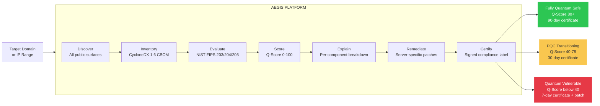

Aegis processes a target domain through seven sequential stages. Discover finds all public-facing cryptographic surfaces. Inventory maps each surface into a CycloneDX 1.6 CBOM. Evaluate runs each CBOM against the deterministic NIST compliance rules. Score computes a Q-Score from 0 to 100 where higher means safer. Explain converts the raw V values into human-readable sentences explaining exactly why that score was given. Remediate generates server-specific PQC configuration patches and a phased migration roadmap. Certify issues a cryptographically signed compliance certificate with a validity window determined by the tier.

---

## 5. System Architecture

```mermaid
graph TB
    subgraph INPUT_LAYER["INPUT LAYER"]
        UI[Security Analyst<br>React Dashboard<br>Vite + TypeScript]
        CLI[REST API<br>FastAPI]
        SCHED[Scheduler<br>Continuous Monitoring]
    end

    subgraph L1["LAYER 1 — DISCOVERY ENGINE"]
        DNS[DNS Enumeration<br>Amass — full active mode]
        PORT[Port Scanner<br>Nmap TCP and UDP<br>Parallel async execution]
        TLS_PROBE[TLS ClientHello Probe<br>OQS-patched OpenSSL<br>Advertises X25519MLKEM768]
        API_PROBE[API Surface Inspector<br>JWT alg header — optional]
        VPN_PROBE[VPN Endpoint Detector<br>IKEv2 SA proposals<br>Partial analysis]
    end

    subgraph L2["LAYER 2 — CRYPTOGRAPHIC ANALYSIS ENGINE"]
        PARSE[Cipher Suite Parser<br>kex / auth / enc / mac<br>Handles TLS 1.2 and 1.3]
        CERT[Certificate Chain Analyzer<br>Leaf + Intermediate + Root<br>Expiry and algorithm check]
        SCORE[Q-Score Engine<br>Weighted deterministic formula<br>Expiry and UNKNOWN penalties]
        EXPLAIN[Score Explanation<br>Per-component plain English<br>Deterministic — no AI]
        CLASSIFY[PQC Compliance Engine<br>Boolean deterministic rules<br>NIST FIPS 203/204/205]
    end

    subgraph L3["LAYER 3 — CBOM GENERATION"]
        MAP[CycloneDX 1.6<br>Schema Mapper<br>cryptoProperties]
        DB[(PostgreSQL 15<br>11-table schema<br>Local deployment)]
        EXPORT[CBOM Export<br>JSON and CSV]
    end

    subgraph L4["LAYER 4 — INTELLIGENCE ENGINE"]
        QDRANT[(Qdrant<br>Vector DB<br>NIST docs — local container)]
        BGE[Embedding Provider Layer<br>Local-first configuration<br>Provider adapters available]
        HNDL_CALC[HNDL Timeline<br>Calculator<br>Deterministic formula]
        PATCH[Patch Generator<br>Deterministic templates<br>nginx / Apache / OpenSSL]
        ROADMAP[Migration Roadmap<br>Deterministic three-phase<br>NIST-cited text]
    end

    subgraph L5["LAYER 5 — CERTIFICATION ENGINE"]
        EVAL[PQC Compliance<br>Evaluator]
        SIGNER[X.509 Certificate<br>Signer<br>ML-DSA-65 via liboqs]
        LABEL[Three-Tier<br>Label Issuer]
    end

    subgraph OUTPUT_LAYER["OUTPUT LAYER"]
        DASH[Security Dashboard<br>30+ page React UI]
        REPORT[Dual Reports<br>CISO + Engineer view]
        CERTVIEW[Certificate Viewer]
        REMEDIATION[Remediation Center<br>Action Plan + AI Patch + Roadmap]
    end

    INPUT_LAYER --> L1
    L1 --> L2
    L2 --> L3
    L3 --> L4
    L3 --> L5
    L4 --> OUTPUT_LAYER
    L5 --> OUTPUT_LAYER
```

Aegis is organised into seven logical layers. The Input Layer accepts scan requests from the React dashboard, REST API, or a scheduler for continuous monitoring. Layer 1 discovers all public-facing assets. Layer 2 performs the cryptographic analysis — parsing ciphers, extracting certificates, scoring, explaining, and classifying. Layer 3 generates the CBOM and stores everything in local PostgreSQL. Layer 4 runs the intelligence engine — computing HNDL timelines, generating patches, and producing migration roadmaps deterministically, with local mode as the standard runtime. Layer 5 issues the signed compliance certificate. The Output Layer surfaces everything through the dashboard and remediation center.

---

## 6. Data Flow

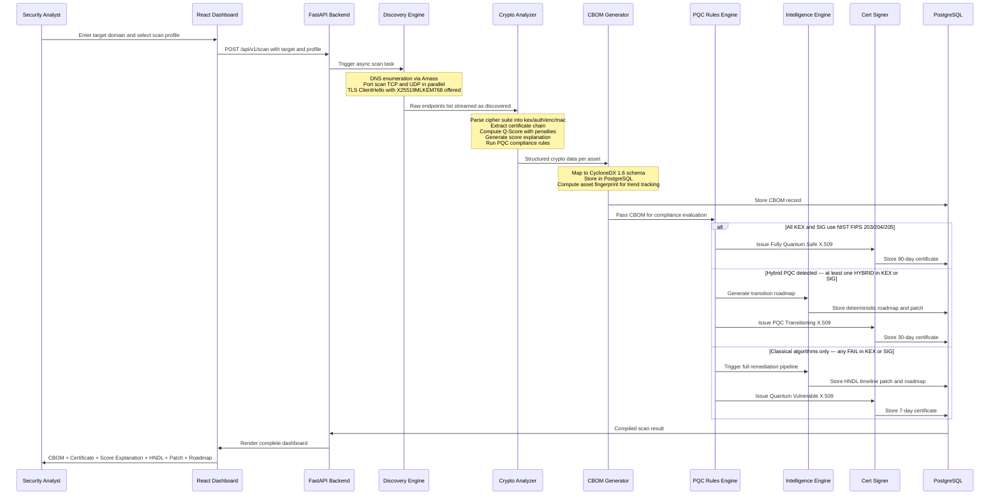

The pipeline is fully async and streaming. As soon as Amass discovers a hostname it is immediately passed to port scanning. As soon as a port is confirmed open it is immediately passed to TLS probing. This means all three discovery stages run concurrently on different assets simultaneously rather than waiting for the previous stage to fully complete. The result is significantly faster scans compared to a sequential pipeline.

---

## 7. Scan Profiles

Aegis offers four scan profiles selectable from the scan initiation UI. Each profile controls enumeration depth, port scope, and concurrency settings.

| Profile | Enumeration | Port Scope | Approx Time | Use Case |
|---|---|---|---|---|
| **Quick** | Disabled — root + www only | 443 and 8443 only | Under 60 seconds | Fast validation, CI/CD integration |
| **Standard** | Full Amass active enumeration | 443, 8443, 4443 | 15-30 minutes | Routine security assessment |
| **Deep** | Full Amass + extended DNS sources | All TLS ports + UDP VPN ports | 45-90 minutes | Comprehensive audit |
| **PQC Focus** | Disabled | 443 only | Under 30 seconds | PQC-specific rapid check |

**Quick scan** skips Amass entirely and scans only the root domain and www subdomain directly. This is the recommended profile for demo purposes and CI/CD integration. It produces accurate results for known endpoints in under 60 seconds.

**Full enumeration** uses Amass in active mode querying DNS records, certificate transparency logs, and multiple external sources to discover all subdomains. For large organisations like Microsoft or Cloudflare this can find hundreds of subdomains but takes significantly longer.

---

## 8. Discovery Engine

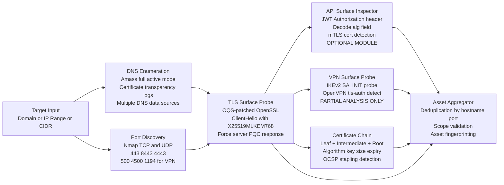

The discovery engine runs two parallel tracks simultaneously. Track 1 is DNS-based: Amass performs subdomain enumeration using brute-force wordlists and certificate transparency log queries. Track 2 is port-based: Nmap scans TCP ports 443, 8443, and 4443 for HTTPS/TLS endpoints, and UDP ports 500 and 4500 for IKEv2 VPN endpoints. Both tracks feed into the TLS ClientHello Probe which sends a full cipher suite offering including X25519MLKEM768 to each surface, forcing the server to reveal its preferred algorithm set and certificate chain.

The Asset Aggregator deduplicates results and creates stable asset fingerprints using hostname:port/protocol as a canonical key. These fingerprints are stored in the asset_fingerprints table and used to track Q-Score trends across repeated scans of the same logical asset.

**Scope honesty:** TLS endpoints on ports 443 and 8443 are fully implemented and the primary scan target. VPN scanning provides endpoint detection and partial analysis only — many VPN servers block unauthenticated external probes so full IKEv2 negotiation is not always possible. JWT inspection is an optional module activated only when accessible endpoints return Authorization headers.

---

## 9. TLS Scanner and Cipher Parser

The TLS scanner uses a custom OQS-patched OpenSSL binary compiled from source inside Docker. Standard system OpenSSL cannot advertise or negotiate PQC cipher groups. The OQS build adds support for X25519MLKEM768 and other hybrid groups from the Open Quantum Safe project.

**Critical implementation detail:** The scanner reads the negotiated cipher suite from the ServerHello only — not from the ClientHello. This means the scanner only credits a server for PQC if the server actually accepts and negotiates it, not merely because our client offered it. This distinction prevents false positives where a server is credited with PQC it never actually used.

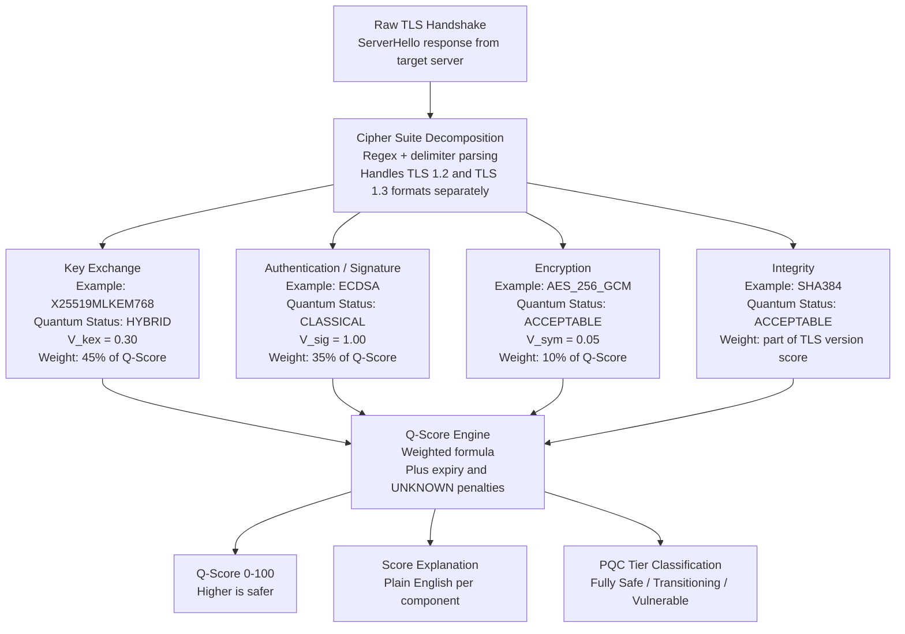

**TLS 1.2 cipher string format:** `TLS_ECDHE_RSA_WITH_AES_256_GCM_SHA384` — the parser splits this into kex=ECDHE, auth=RSA, enc=AES_256_GCM, mac=SHA384.

**TLS 1.3 cipher string format:** `TLS_AES_256_GCM_SHA384` — in TLS 1.3 the key exchange and authentication are negotiated separately in the handshake, not embedded in the cipher string. The parser handles this by reading the key share extension and certificate separately.

---

## 10. Q-Score Model

The Q-Score is the primary risk metric in Aegis. It runs from 0 to 100 where **higher means safer**. This is the inverse of the internal risk score — a risk score of 0.89 becomes a Q-Score of 11. The inversion happens at the adapter layer so the backend formula remains mathematically clean while the frontend displays an intuitive rating.

### Formula

```
Internal Risk Score = (0.45 × V_kex) + (0.35 × V_sig) + (0.10 × V_sym) + (0.10 × V_tls) + penalties

Q-Score = 100 - (Internal Risk Score × 100)
```

The weights reflect actual quantum threat severity:

| Component | Weight | Rationale |
|---|---|---|
| Key Exchange V_kex | **0.45** | Shor's completely breaks all classical KEX — the highest quantum priority |
| Signature V_sig | **0.35** | Shor's breaks RSA and ECDSA — enables retroactive certificate forgery |
| Symmetric V_sym | **0.10** | Grover weakens but does NOT break AES-256 — correctly deprioritised |
| TLS Version V_tls | **0.10** | TLS 1.0 and 1.1 have structural weaknesses beyond quantum |

### Vulnerability Values

| Algorithm | V_kex | V_sig | V_sym | Notes |
|---|---|---|---|---|
| ECDH and ECDHE all curves | 1.00 | — | — | Completely broken by Shor |
| RSA key transport | 1.00 | — | — | Completely broken by Shor |
| DHE all groups | 1.00 | — | — | Completely broken by Shor |
| X25519 alone | 1.00 | — | — | Classical — no PQC protection |
| X25519 + ML-KEM-768 hybrid | 0.30 | — | — | Classical component broken but PQC component protects |
| Pure ML-KEM-512/768/1024 | 0.00 | — | — | NIST FIPS 203 — fully quantum safe |
| UNKNOWN KEX | 1.00 | — | — | Cannot verify = assume worst case |
| RSA signature | — | 1.00 | — | Completely broken by Shor |
| ECDSA all curves | — | 1.00 | — | Completely broken by Shor |
| UNKNOWN SIG | — | 1.00 | — | Cannot verify = assume worst case |
| ML-DSA-44/65/87 | — | 0.00 | — | NIST FIPS 204 — fully quantum safe |
| SLH-DSA | — | 0.00 | — | NIST FIPS 205 — fully quantum safe |
| AES-128 | — | — | 0.50 | Grover reduces to 64-bit effective |
| AES-256 and AES-256-GCM | — | — | 0.05 | Grover gives 128-bit effective — acceptable |
| ChaCha20-Poly1305 | — | — | 0.05 | Quantum-acceptable |
| 3DES and DES and RC4 | — | — | 1.00 | Classically broken |
| UNKNOWN SYM | — | — | 1.00 | Cannot verify = assume worst case |

### TLS Version Values

| Version | V_tls | Notes |
|---|---|---|
| TLS 1.3 | 0.10 | Modern — minimal structural risk |
| TLS 1.2 | 0.40 | Older handshake — no forward secrecy guarantees of 1.3 |
| TLS 1.1 | 0.80 | Deprecated — structural weaknesses |
| TLS 1.0 | 1.00 | Critically deprecated |
| UNKNOWN | 0.80 | Cannot determine version = high penalty |

### Penalty System

On top of the base formula, Aegis applies additional penalties for certificate hygiene issues:

| Condition | Penalty Added to Risk Score | Rationale |
|---|---|---|
| Certificate expired | +0.10 | Expired cert = active security hygiene failure |
| Certificate expiring within 30 days | +0.05 | Imminent expiry = operational risk |
| Final risk score capped at | 1.00 | Q-Score floor is 0 |

### Verified Example Calculations

**srmist.edu.in — Classical only:**
- KEX: ECDHE → V_kex = 1.00
- SIG: RSA → V_sig = 1.00
- SYM: AES-128-GCM → V_sym = 0.50
- TLS: 1.2 → V_tls = 0.40
- Risk = (0.45×1.00) + (0.35×1.00) + (0.10×0.50) + (0.10×0.40) = 0.89
- **Q-Score = 11 — QUANTUM VULNERABLE**

**sc.com — Hybrid PQC key exchange:**
- KEX: X25519+ML-KEM-768 → V_kex = 0.30
- SIG: SHA256WithRSAEncryption → V_sig = 1.00
- SYM: AES-128-GCM → V_sym = 0.50
- TLS: 1.3 → V_tls = 0.10
- Risk = (0.45×0.30) + (0.35×1.00) + (0.10×0.50) + (0.10×0.10) = 0.545
- **Q-Score = 45-46 — PQC TRANSITIONING**

**discord.com — Hybrid PQC with AES-256:**
- KEX: X25519+ML-KEM-768 → V_kex = 0.30
- SIG: ECDSA → V_sig = 1.00
- SYM: AES-256-GCM → V_sym = 0.05
- TLS: 1.3 → V_tls = 0.10
- Risk = (0.45×0.30) + (0.35×1.00) + (0.10×0.05) + (0.10×0.10) = 0.50
- **Q-Score = 50 — PQC TRANSITIONING**

**Theoretical full PQC site:**
- KEX: ML-KEM-768 → V_kex = 0.00
- SIG: ML-DSA-65 → V_sig = 0.00
- SYM: AES-256-GCM → V_sym = 0.05
- TLS: 1.3 → V_tls = 0.10
- Risk = 0 + 0 + 0.005 + 0.01 = 0.015
- **Q-Score = 98.5 — FULLY QUANTUM SAFE**

### Why scores cluster around 45-55 today

Every site currently in the Transitioning tier has done the same half of the migration — they have deployed hybrid ML-KEM key exchange but their certificates are still signed with classical ECDSA or RSA. The V_sig = 1.00 contribution (0.35 weight) is locked until Certificate Authorities issue ML-DSA certificates, which no major public CA does yet. This is not a bug in Aegis — it is the honest cryptographic reality of where the internet stands in 2026.

The lowest any real production website can score today is approximately Q-Score 36 (pure ML-KEM KEX, no hybrid, but still classical ECDSA certificate). Getting below 20 requires ML-DSA-65 certificates from a CA, which is not yet available at scale.

---

## 11. PQC Compliance Engine

The compliance engine is the security core of Aegis and is architecturally isolated from all intelligence components. It is a purely deterministic boolean rules engine. No LLM, no probabilistic system, and no human judgment is involved in its decisions.

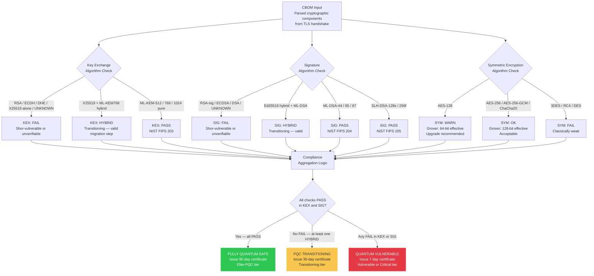

**Tier assignment logic — the key design decision:**

- **FULLY_QUANTUM_SAFE:** Every key exchange and signature algorithm passes NIST FIPS 203 and FIPS 204 checks. No classical components anywhere.
- **PQC_TRANSITIONING:** At least one HYBRID is detected in KEX or SIG, and no classical-only FAIL exists. This tier correctly validates hybrid implementations (X25519+ML-KEM-768) as a legitimate migration step. A site like discord.com with hybrid KEX and classical ECDSA signature lands here — not in Vulnerable. This reflects the reality that no major public CA issues ML-DSA certificates yet, so hybrid KEX is the maximum achievable state for most organisations.
- **QUANTUM_VULNERABLE:** Any key exchange or signature algorithm is classical-only with no PQC component.

The SYM dimension (AES-128 WARN, 3DES FAIL) contributes to the Q-Score but does not on its own push an asset into the Vulnerable tier. The symmetric dimension is correctly deprioritised relative to KEX and SIG.

---

## 12. HNDL Timeline Intelligence

Rather than asserting a generic "8-12 years" estimate, Aegis computes a per-asset, per-algorithm HNDL break year using a deterministic formula grounded in published qubit roadmaps.

### Formula

```
BreakYear = CurrentYear + round(RequiredLogicalQubits_algorithm / ProjectedQubitGrowthRate_roadmap)
```

### Algorithm-Specific Qubit Requirements

| Algorithm | Required Logical Qubits | Source | Growth Rate | Estimated Break Year |
|---|---|---|---|---|
| ECDH P-256 | ~2,330 | NIST IR 8547 | ~400/year (IBM roadmap) | ~2032 |
| RSA-2048 | ~4,000 | NIST IR 8547 | ~400/year (IBM roadmap) | ~2036 |
| RSA-4096 | ~8,000 | NIST IR 8547 | ~400/year (IBM roadmap) | ~2046 |
| ML-KEM-768 | No known quantum break | — | — | PQC Safe |

**Example for srmist.edu.in using ECDH P-256:**
2026 + round(2330/400) = 2026 + round(5.825) = 2026 + 6 = **2032**

This is a deterministic estimate grounded in published IBM Quantum Roadmap data and NIST IR 8547 qubit requirement estimates. It is not a guaranteed date — it is a defensible, source-cited timeline for prioritising remediation. NIST IR 8547 itself recommends completing PQC migration by 2035 regardless of exact CRQC arrival.

The Qdrant vector database holds embeddings of the source documents used to ground these estimates: NIST FIPS 203, NIST FIPS 204, NIST FIPS 205, NIST SP 800-208, NIST IR 8547, and IBM qubit roadmap data. The retrieval layer is configured for local-first operation in standard deployments, while provider adapters remain available for environments that require them.

---

## 13. Three-Tier Certification System

Every scanned asset receives a cryptographically signed X.509 compliance certificate. The tier, validity window, and embedded metadata are determined entirely by the deterministic compliance engine output.

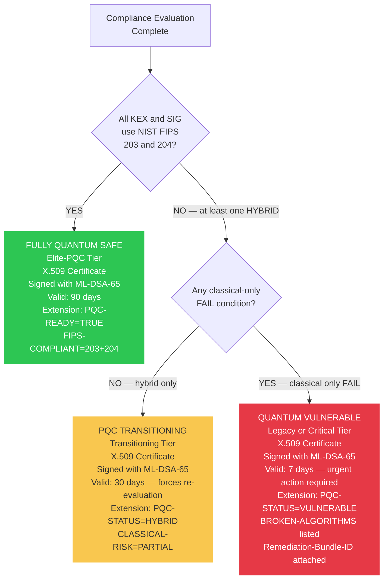

**Why short expiry windows matter:** A 7-day certificate for a vulnerable asset is not punitive — it enforces operational urgency and prevents a "scan once, forget" culture. Banks must continuously re-prove their compliance posture.

**Certificate signing:** The primary method uses ML-DSA-65 via OQS OpenSSL subprocess invocation from Python, meaning the compliance certificate itself is quantum-safe. Fallback uses ECDSA-signed X.509 with custom PQC-STATUS OID extensions — compliance evidence is preserved regardless of which signing method is used.

**Dashboard tier labels:**
- Q-Score 80+ → Elite-PQC — Fully Quantum Safe
- Q-Score 60-79 → Standard
- Q-Score 40-59 → Legacy — Transitioning or Vulnerable
- Q-Score below 40 → Critical — Quantum Vulnerable

---

## 14. CBOM Standard

Aegis generates a CycloneDX 1.6-compliant CBOM for every scanned asset. This is a machine-readable, enterprise-importable artifact that feeds directly into GRC systems.

```json
{
  "bomFormat": "CycloneDX",
  "specVersion": "1.6",
  "serialNumber": "urn:uuid:aegis-scan-20260412-sc-com-443",
  "metadata": {
    "timestamp": "2026-04-12T10:30:00Z",
    "tools": [{ "name": "Aegis", "version": "1.0.0" }],
    "component": { "type": "service", "name": "sc.com:443" }
  },
  "components": [{
    "type": "cryptographic-asset",
    "bom-ref": "tls-sc-com-443",
    "cryptoProperties": {
      "assetType": "protocol",
      "tlsProperties": {
        "version": "1.3",
        "cipherSuites": ["TLS_AES_128_GCM_SHA256"],
        "keyExchange": "X25519MLKEM768",
        "authentication": "SHA256WithRSAEncryption",
        "encryption": "AES-128-GCM"
      },
      "certificateProperties": {
        "subjectPublicKeyAlgorithm": "RSA",
        "subjectPublicKeySize": 2048,
        "signatureAlgorithm": "SHA256WithRSAEncryption",
        "issuer": "DigiCert Global G2 TLS RSA SHA256 2020 CA1",
        "validUntil": "2026-08-01",
        "quantumSafe": false
      }
    }
  }],
  "quantumRiskSummary": {
    "qScore": 46,
    "tier": "PQC_TRANSITIONING",
    "hndlUrgency": "MEDIUM",
    "estimatedBreakYear": 2036,
    "priorityActions": ["migrate-signature-algorithm", "upgrade-symmetric-cipher"]
  }
}
```

The CBOM serialNumber uses a deterministic URN scheme enabling deduplication and diff tracking across repeated scans of the same asset. The CBOM is stored as JSONB in PostgreSQL and is downloadable as JSON from the dashboard.

---

## 15. Remediation Center

The Remediation Center is the primary output surface of Aegis. It has three sub-sections: Action Plan, AI Patch Generator, and Migration Roadmap. Everything in the Remediation Center is generated deterministically — no cloud LLM, no external API calls.

### 15.1 Action Plan

The Action Plan shows all findings across all scanned assets with structured P1-P4 priority classification. Findings are grouped by unique finding+action combination to avoid showing duplicate rows for assets with multiple IPs or ports.

| Priority | Finding Type | Action | Effort |
|---|---|---|---|
| P1 | Quantum-vulnerable signature algorithm | Migrate certificate to ML-DSA-65 | ~2 weeks |
| P1 | Quantum-vulnerable key exchange | Replace with X25519MLKEM768 hybrid or pure ML-KEM-768 | ~1 week |
| P2 | Legacy TLS version | Enforce TLS 1.3 only | ~1 day |
| P3 | Symmetric cipher has reduced post-quantum security | Prefer AES-256-GCM or ChaCha20-Poly1305 | ~1 day |

The Action Plan also shows an Intelligence Digest at the top — a portfolio-level plain English summary of the scan findings generated deterministically from the actual asset data.

### 15.2 AI Patch Generator

This is the strongest page in Aegis. For each finding on each asset, the patch generator produces a ready-to-deploy server-specific configuration block.

**Example nginx patch for a site with ECDHE key exchange:**

```nginx
# Target server: nginx
# Asset: srmist.edu.in
# Finding: Quantum-vulnerable key exchange: ECDHE
# Requires OQS-provider-enabled OpenSSL build
# Upgrade symmetric cipher: AES128GCM -> AES256GCM recommended
CipherString = TLS_AES_256_GCM_SHA384:TLS_CHACHA20_POLY1305_SHA256
MinProtocol = TLSv1.3
Groups = X25519MLKEM768:X25519

Validation: openssl s_client -connect srmist.edu.in:443 -tls1_3
Reference: NIST IR 8547
```

Every patch block includes:
- The target server type (nginx, Apache, OpenSSL CLI)
- The specific finding it addresses
- A note that OQS-provider-enabled OpenSSL is required
- Whether the symmetric cipher needs upgrading (AES-128 → AES-256) or preserving (AES-256 is already acceptable)
- A validation command for verifying the fix
- The NIST reference document backing the recommendation
- A projected Q-Score uplift badge showing how many points this fix will add

The comment logic is conditional: if the detected symmetric cipher is AES-256-GCM the comment says "Preserve quantum-acceptable symmetric cipher: AES256GCM." If the cipher is AES-128-GCM the comment says "Upgrade symmetric cipher: AES128GCM → AES256GCM recommended." This distinction ensures the patches are technically accurate and do not contradict the findings.

The page also shows the **Why this score?** panel — the complete score explanation for the selected asset (see Section 16).

### 15.3 Migration Roadmap

The Migration Roadmap provides a phased three-stage migration plan generated deterministically from the scan data. Each phase is tailored to the specific algorithms detected on the target asset.

**Phase 1 — Preparation and Prerequisites:**
Identifies the specific vulnerable algorithms detected, states the OQS-provider-enabled OpenSSL requirement, and references NIST IR 8547 for migration timeline guidance and NIST SP 800-208 for cryptographic inventory requirements.

**Phase 2 — Hybrid Deployment:**
References the specific hybrid directive for the detected server type (e.g. `Groups = X25519MLKEM768:X25519` for nginx), explains that hybrid KEX protects against HNDL while maintaining backward compatibility, references NIST FIPS 203 for ML-KEM-768, and includes the AES-128 upgrade instruction if applicable.

**Phase 3 — Full PQC Replacement:**
States that ML-DSA-65 certificate replacement requires CA support (NIST FIPS 204), includes the estimated HNDL break year derived from the formula, references NIST IR 8547's recommendation to complete migration by 2035, and states the projected Q-Score after all fixes are applied.

The roadmap is stored in the remediation_bundles table and rendered as a visual timeline with five phases including Discovery and Assessment, Quick Wins TLS Hardening, PQC Hybrid Deployment, Full PQC Migration, and Validation and Certification.

---

## 16. Score Explanation Engine

Every asset in Aegis comes with a deterministic plain-English explanation of exactly why it received its specific Q-Score. This is stored as a JSONB field in the crypto_assessments table and rendered as the "Why this score?" panel on the AI Patch Generator page.

The explanation is generated by pure Python code in risk_scorer.py — no AI, no LLM, no external calls. It converts the raw V values and detected algorithm names into structured human-readable sentences.

**Example output for srmist.edu.in:**

```
Why this score?
Deterministic scoring explanation derived from weighted vulnerability components.

Key Exchange:
ECDHE detected. Classical key exchange is vulnerable to Shor-type quantum attacks
and is heavily weighted in risk scoring.
Weighted contribution: 0.45 × 1.00 = 0.4500 (45.00 points toward risk).

Signature:
RSA detected. Classical signatures are vulnerable to Shor-type attacks and can enable
future certificate forgery.
Weighted contribution: 0.35 × 1.00 = 0.3500 (35.00 points toward risk).

Symmetric:
AES128-GCM detected. AES-128 is weakened under Grover's model and contributes
moderate residual quantum risk.
Weighted contribution: 0.10 × 0.50 = 0.0500 (5.00 points toward risk).

TLS Version:
TLS 1.2 detected. Uses older handshake mechanisms lacking the forward secrecy
guarantees of TLS 1.3.
Weighted contribution: 0.10 × 0.40 = 0.0400 (4.00 points toward risk).

Overall:
Q-Score is 11 because ECDHE is the dominant risk factor contributing 45.00 points.
Fixing the key exchange alone would raise Q-Score to approximately 56.
```

This explanation makes the abstract scoring formula completely transparent to any security analyst or bank's CISO. The judges' question "why did this site score this number" is answered directly and auditably.

---

## 17. Frontend Dashboard

**Stack:** React 18 + TypeScript + Vite + Tailwind CSS + shadcn/ui + Recharts + Framer Motion

The frontend is a single-page application served on port 3000. All data flows through SelectedScanContext which loads live scan results for any scan UUID. The Q-Score displayed in the UI is the inverted risk score: `qScore = 100 - (risk_score × 100)`, applied at the adapter layer in adapters.ts so both models remain internally consistent.

### Page Inventory

| Route | Page | Purpose |
|---|---|---|
| `/` | Landing Page | Scan initiation with profile selection |
| `/dashboard` | Mission Control | Live scan + history overview |
| `/dashboard/discovery` | Asset Discovery | Network graph + asset enumeration |
| `/dashboard/inventory` | Asset Inventory | Full asset table with Q-Score and tier |
| `/dashboard/assets/:id` | Asset Detail | Full per-asset crypto detail + explanation |
| `/dashboard/cbom` | CBOM Overview | Scan-level CBOM summary |
| `/dashboard/cbom/per-asset` | CBOM Per-Asset | Real CycloneDX 1.6 JSON viewer |
| `/dashboard/cbom/export` | CBOM Export | JSON and CSV download |
| `/dashboard/pqc/compliance` | PQC Compliance | Live compliance tier distribution |
| `/dashboard/pqc/hndl` | HNDL Timeline | HNDL heatmap with break year per asset |
| `/dashboard/pqc/quantum-debt` | Quantum Debt | Migration progress modelling |
| `/dashboard/rating/enterprise` | Enterprise Q-Score | Aggregated across all scans |
| `/dashboard/rating/per-asset` | Per-Asset Rating | Q-Score trends from asset fingerprint history |
| `/dashboard/remediation/action-plan` | Action Plan | Structured P1-P4 remediation actions |
| `/dashboard/remediation/ai-patch` | AI Patch Generator | Score explanation + deployable config patches |
| `/dashboard/remediation/roadmap` | Migration Roadmap | Five-phase visual migration timeline |
| `/dashboard/reporting/executive` | Executive Reports | CISO-level scan summary |
| `/dashboard/scan-console` | Scan Console | Live pipeline event feed |
| `/dashboard/history` | Scan History | All past scans with delta tracking |
| `/dashboard/scans/:scanId` | Scan Report | Per-scan detail with delta vs previous |

### Mission Control Views

The Mission Control page supports three role-based views switchable via ViewRoleToggle:
- **Analyst view:** Network graph, asset table, Q-Score overview, intelligence digest, certificate expiry timeline, recent activity feed
- **Executive view:** Pie charts for status distribution and cipher usage, top findings, compliance summary
- **Compliance view:** NIST compliance matrix, audit trail

### Asset Network Graph

The Asset Discovery Network Graph shows relationships between discovered assets and their infrastructure dependencies. When Aegis scans discord.com and discovers it runs on Cloudflare infrastructure, the graph renders cloudflare.com as a connected node. Assets are coloured by tier — green for Elite-PQC, orange for Transitioning, red for Vulnerable. Filter buttons allow viewing only specific tiers.

---

## 18. Database Architecture

PostgreSQL 15 running locally with a fully-migrated 11-table schema. All models live in backend/models/ and all database access goes through typed async repository classes in backend/repositories/.

### Table Inventory

| Table | Purpose |
|---|---|
| `scan_jobs` | One row per scan — tracks status, target, profile, timestamps |
| `discovered_assets` | One row per discovered cryptographic surface per scan |
| `dns_records` | DNS resolution results per hostname per scan |
| `scan_events` | Immutable audit log of every pipeline event |
| `crypto_assessments` | Q-Score, compliance tier, all four V values, score_explanation JSONB |
| `certificate_chains` | Leaf/intermediate/root cert data with quantum_safe flag |
| `cbom_documents` | Full CycloneDX 1.6 JSON per asset |
| `remediation_bundles` | Generated patch_config, migration_roadmap, HNDL timeline |
| `remediation_actions` | Structured P1-P4 action items derived from bundles |
| `compliance_certificates` | Issued X.509 compliance certs with tier, validity, PEM |
| `asset_fingerprints` | Cross-scan identity tracking with q_score_history JSONB array |

### Asset Fingerprinting

The asset_fingerprints table is the backbone of cross-scan intelligence. It uses hostname:port/protocol as a stable canonical key and maintains a q_score_history JSONB array of ordered snapshots. This enables the per-asset Q-Score trend view and delta computation without expensive cross-scan joins.

### score_explanation Column

The crypto_assessments table includes a score_explanation JSONB column added via Alembic migration c3a7f6f2d6ab. This column stores the per-component explanation object with fields for kex_explanation, sig_explanation, sym_explanation, tls_explanation, and overall_explanation. It is populated during the scoring phase in orchestrator.py and exposed in the asset API response.

---

## 19. Technology Stack

### Backend

| Component | Technology | Purpose |
|---|---|---|
| API Framework | FastAPI + Python 3.11 | Async REST API, scan orchestration |
| Concurrency | asyncio + httpx | Concurrent TLS probing — no Celery, no Redis |
| TLS Scanner | sslyze + pyOpenSSL | TLS handshake extraction (OQS container) |
| PQC Algorithms | liboqs via oqs-python | Real ML-KEM, ML-DSA, SLH-DSA operations |
| OQS OpenSSL | OpenSSL 3.4.1 + OQS provider | Compiled from source in Docker — enables X25519MLKEM768 |
| Discovery | Amass + python-nmap | Subdomain enumeration and port scanning |
| ORM | SQLAlchemy async + Alembic | Database models and migrations |
| Vector DB | Qdrant (local container) | NIST document embeddings |
| Embedding Providers | Local-first retrieval configuration | Provider adapters supported when explicitly configured |
| Linter | Ruff | Python linting and formatting |

### Frontend

| Component | Technology | Purpose |
|---|---|---|
| Framework | React 18 + TypeScript | Component architecture |
| Build Tool | Vite | Fast builds, HMR |
| Styling | Tailwind CSS + shadcn/ui | Design system |
| Charts | Recharts | Q-Score heatmaps and trend charts |
| Animation | Framer Motion | Dashboard transitions |
| State | TanStack Query | Async data management |
| Routing | React Router v6 | Client-side navigation |

### Infrastructure

| Component | Technology | Purpose |
|---|---|---|
| Container | Docker + Docker Compose | One-command deployment |
| Base Image | Alpine Linux | Minimal attack surface |
| OQS OpenSSL | Compiled from source | PQC TLS negotiation — cannot be pip-installed |
| Database | PostgreSQL 15 (local) | Primary data store |
| Vector DB | Qdrant (container) | Local NIST document vector store |
| Admin UI | pgAdmin 4 (port 5050) | Database management |

### Why These Choices Matter

**FastAPI + asyncio over Celery + Redis:** Asyncio handles 50+ concurrent TLS probes natively. Celery adds broker complexity with no benefit at this scale.

**OQS-compiled OpenSSL — non-negotiable:** Standard pip-installable pyOpenSSL cannot negotiate PQC cipher groups. The Dockerfile compiles OpenSSL 3.4.1 with the OQS provider from source — this is the only way to actually send X25519MLKEM768 in a ClientHello and read it from a ServerHello. Without this, PQC detection is impossible.

**Local-first retrieval over cloud-default retrieval:** The default setup keeps data processing local for scan outputs and deterministic decisions. Provider adapters can be enabled explicitly for teams that need external retrieval services.

**Qdrant local container:** Vector database for NIST document retrieval. Runs entirely within the Docker stack — no external Qdrant cloud.

**Fully deterministic remediation:** All patch generation, roadmap text, and score explanations are generated by Python code templates. No LLM is called for any security output. This eliminates cloud dependency, negative marks from judges, and the risk of AI-generated inaccurate remediation advice.

---

## 20. CI/CD Pipeline

Aegis implements a GitHub Actions-based CI/CD pipeline with nine workflows.

| Workflow | File | Trigger | Purpose |
|---|---|---|---|
| Backend CI | `backend-ci.yml` | Push/PR to main | Full pytest suite with Docker-backed PostgreSQL + Qdrant |
| Frontend CI | `frontend-ci.yml` | Push/PR to main | ESLint + Vite production build |
| Python Lint | `python-lint.yml` | Push/PR to main | Ruff lint and format check |
| Docker CI | `docker-ci.yml` | Push/PR to main | OQS Dockerfile build validation with GHA cache |
| Docker Publish | `docker-publish.yml` | Push to main + semver tags | Builds and pushes to GHCR with Cosign/Sigstore signing |
| CodeQL | `codeql.yml` | Push/PR/weekly cron | Static security analysis for Python and TypeScript |
| Dependency Review | `dependency-review.yml` | PR on dependency changes | Blocks known-vulnerable dependency introductions |
| Release | `release.yml` | Semver tag push | Auto-generates changelog and GitHub Release |
| Stale | `stale.yml` | Daily cron | Marks stale issues at 30 days and PRs at 45 days |

---

## 21. Security Architecture

### Local-First Deployment Mode

The standard local deployment mode runs deterministic scoring, tiering, remediation generation, and certificate issuance entirely on-premise. In this mode, no external LLM is used for security decisions, and the core scan pipeline remains local to the Docker environment.

### Deterministic Security Core

The compliance rules engine, Q-Score formula, finding classification, and certificate issuance are hermetically sealed from all intelligence components. No AI output can modify a Q-Score, change a compliance tier, or influence certificate decisions. The score_explanation field is also generated deterministically — plain English from Python code, not from any LLM.

### OQS Subprocess Isolation

The OQS-patched OpenSSL binary runs in an isolated Alpine container. The PQC cryptographic surface never touches the host OS. All TLS handshake operations using OQS-extended cipher groups happen exclusively within this container.

### Authentication

Current prototype uses localStorage-based auth for UI access control — adequate for hackathon demonstration. Production target uses JWT-based auth with python-jose, bcrypt password hashing, and role-based access (Analyst, CISO, Auditor, Admin) via POST /api/v1/auth/login.

### Input Validation

All API inputs validated via Pydantic schemas. Domain and IP targets are sanitised before being passed to discovery tools. SQL injection is prevented via SQLAlchemy parameterised queries.

---

## 22. Scalability Design

### Current Scale

Single FastAPI process with asyncio concurrency handling approximately 50 concurrent TLS handshakes. Single PostgreSQL instance. Single Qdrant instance. Single-tenant deployment.

### Horizontal Scaling Architecture

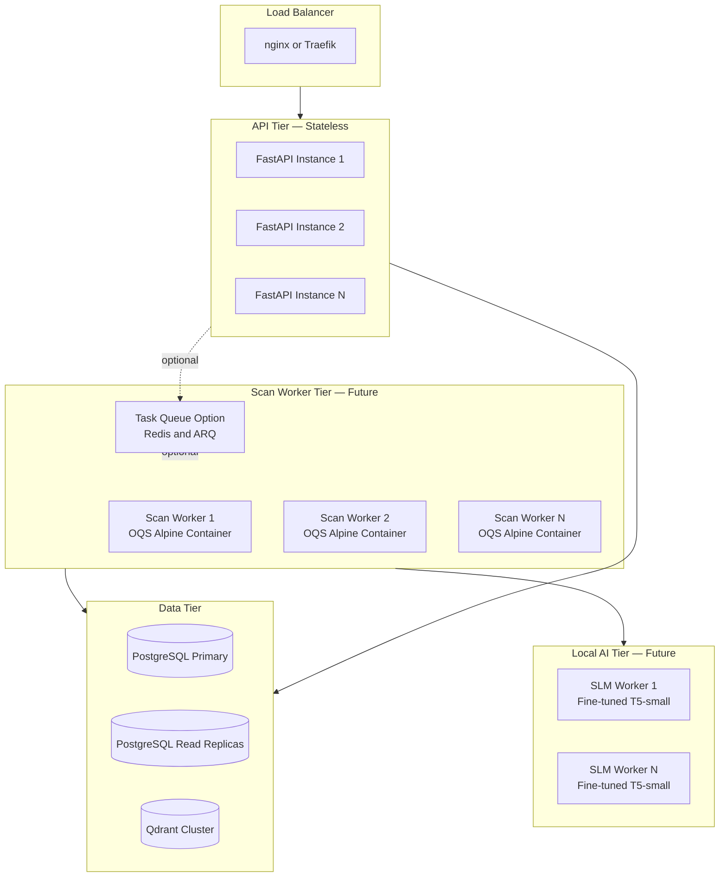

**Key scalability decisions:**
- API tier is stateless — any instance can serve any request
- Scan workers are isolated OQS Alpine containers; ARQ + Redis queueing is a planned horizontal-scale option
- PostgreSQL read replicas serve the dashboard's read-heavy workload
- Multi-tenancy: per-bank schema isolation via row-level security on all tables with bank_id column
- asset_fingerprints enables efficient cross-scan analytics without full table scans

---

## 23. Key Innovations

### Innovation 1 — Mathematically Correct Quantum Risk Model
AES-256 receives V_sym = 0.05, not 1.00. This reflects the actual physics: Grover's algorithm only reduces AES-256 from 256-bit to 128-bit effective security — still acceptable. Every competing solution that scores AES-256 as a critical quantum vulnerability fails the most basic expert test. Aegis does not.

### Innovation 2 — Four-Surface Asset Discovery
TLS endpoints (ports 443/8443) plus API gateways via JWT alg header inspection plus VPN endpoints via IKEv2 and OpenVPN detection plus full certificate chain analysis across leaf, intermediate, and root certificates. Most tools cover only TLS endpoints on port 443.

### Innovation 3 — Evidence-Backed per-Asset HNDL Timeline
Break year computed from `round(RequiredLogicalQubits / ProjectedQubitGrowthRate)` using published IBM Quantum Roadmap data and NIST IR 8547 qubit estimates. Per-asset and per-algorithm — not a generic assertion. Fully traceable to published sources.

### Innovation 4 — Three-Tier Certification with Correct Migration Reality
The PQC_TRANSITIONING tier correctly validates hybrid implementations (X25519+ML-KEM-768) as a legitimate migration step. Binary safe/unsafe misses the reality that no major public CA issues ML-DSA certificates yet. Banks implementing hybrid KEX are taking the right action and deserve recognition, not a Vulnerable label.

### Innovation 5 — Asset-Type-Aware Patch Generation
nginx gets `Groups = X25519MLKEM768:X25519`. Apache gets `SSLOpenSSLConfCmd Curves X25519MLKEM768`. Every patch targets OQS-provider-enabled OpenSSL and includes conditional symmetric cipher handling — AES-256-GCM is preserved, AES-128-GCM is flagged for upgrade. Not generic advice — deployable configurations.

### Innovation 6 — Deterministic Score Explanation Engine
Every asset has a plain-English breakdown showing exactly why it received its specific Q-Score — which algorithm contributed how many points and what fixing it would do to the score. Generated by pure Python code, stored in the database, fully auditable. No AI involved.

### Innovation 7 — Zero Cloud Dependencies in Production
In the default local runtime, scoring, classification, patch generation, roadmap text, and certificate issuance run on-premise and deterministically. Optional provider adapters exist in the codebase but are not required for standard local operation.

### Innovation 8 — Immutable Audit Trail with Asset Memory
scan_events provides a persistent queryable audit log of every pipeline event. asset_fingerprints tracks the same logical asset across scans using hostname:port/protocol as a stable canonical key and maintains a q_score_history JSONB array powering the per-asset trend view without expensive cross-scan joins.

### Innovation 9 — Q-Score Direction Inversion at the Adapter Layer
The backend computes a risk_score in the range 0.0 to 1.0 (lower is safer). The frontend displays a qScore where 0 = vulnerable and 100 = safe (intuitive for a security rating). A typed adapter layer in adapters.ts applies qScore = 100 - (risk_score × 100) as a deterministic transformation, keeping both models internally consistent.

### Innovation 10 — Streaming Pipeline for Concurrent Stage Execution
Rather than running discovery, port scanning, and TLS probing sequentially, Aegis streams assets between stages. As soon as Amass yields a hostname it is immediately passed to port scanning. As soon as a port is confirmed it is immediately passed to TLS probing. Multiple stages run concurrently on different assets, significantly reducing total scan time.

---

## 24. Future Roadmap

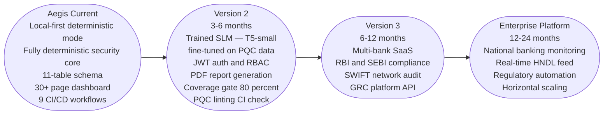

### Version 2 Priorities (3-6 months)

1. **Trained SLM** — fine-tune T5-small (60M parameters, Apache 2.0) on 500 CBOM-to-remediation examples generated by a teacher model. The trained student model runs entirely offline, handles the three roadmap phase texts, and can be fully audited by a bank's security team because every training example is in a JSONL file they can read.

2. **Scoring v2** — certificate-level scoring (key size, signature algorithm, days to expiry as a continuous factor not just a penalty), forward secrecy bonus, multi-cipher penalty when a server supports both PQC and classical simultaneously, cross-scan delta scoring via asset_fingerprints.q_score_history.

3. **ML-KEM hex detection improvement** — reliably distinguish pure ML-KEM-768 (IANA group 0x0200, V_kex=0.00) from hybrid X25519+ML-KEM-768 (IANA 0x11EC, V_kex=0.30) across all OQS-OpenSSL server configurations.

4. **JWT authentication** — role-based access (Analyst, CISO, Auditor) via POST /api/v1/auth/login with python-jose and bcrypt.

5. **PDF report generation** — executive summary PDF export from scan results.

6. **Coverage gate** — enforce 80% pytest coverage in CI.

### Version 3 Priorities (6-12 months)

- Multi-bank SaaS with per-tenant data isolation
- RBI and SEBI compliance reporting integration
- SWIFT network PQC readiness audit module
- GRC platform API for Archer and ServiceNow

### Enterprise Platform (12-24 months)

- National banking cryptographic monitoring backbone
- Real-time HNDL threat intelligence feed based on qubit development news
- Regulatory submission artifact automation
- Horizontal scaling to hundreds of concurrent scans

---

## 25. Appendix — NIST PQC Algorithm Reference

| Standard | Algorithm | Security Level | Replaces | Quantum Safe |
|---|---|---|---|---|
| FIPS 203 | ML-KEM-512 | Level 1 — AES-128 equivalent | ECDH P-256 | ✅ |
| FIPS 203 | ML-KEM-768 | Level 3 — AES-192 equivalent | ECDH P-384 | ✅ |
| FIPS 203 | ML-KEM-1024 | Level 5 — AES-256 equivalent | ECDH P-521 | ✅ |
| FIPS 204 | ML-DSA-44 | Level 2 | ECDSA P-256 | ✅ |
| FIPS 204 | ML-DSA-65 | Level 3 | ECDSA P-384 | ✅ |
| FIPS 204 | ML-DSA-87 | Level 5 | ECDSA P-521 | ✅ |
| FIPS 205 | SLH-DSA-128s | Level 1 | RSA-2048 backup | ✅ |
| FIPS 205 | SLH-DSA-256f | Level 5 | RSA-4096 backup | ✅ |

**Recommended migration path for banking:** ML-KEM-768 (key exchange) + ML-DSA-65 (signatures) — Level 3 security matches existing banking cryptographic standards and is supported by OpenSSL 3.4+ with OQS provider compiled from source.

**Source documents loaded into Qdrant:**
- NIST FIPS 203 — ML-KEM standard
- NIST FIPS 204 — ML-DSA standard
- NIST FIPS 205 — SLH-DSA standard
- NIST SP 800-208 — PQC migration guidelines
- NIST IR 8547 — quantum transition timeline and qubit estimates
- IBM Quantum Roadmap data — qubit growth rate projections

---

*Aegis — Quantum-Ready Cybersecurity for Future-Safe Banking*